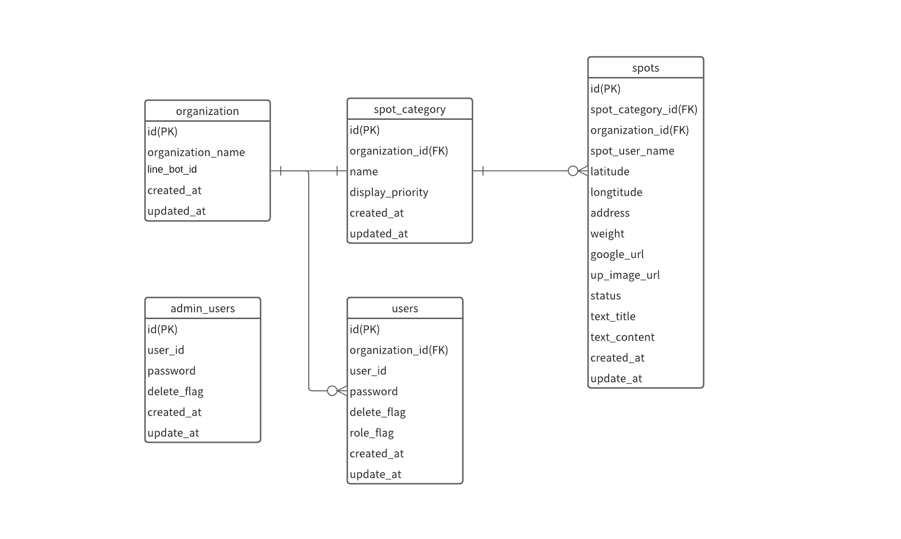

## テーブル・ファイル設計  
### ER図
 

### テーブル一覧
| No | テーブル名             | テーブル概要               |
|----|-------------------|----------------------|
| 1  | spots     | スポット管理                |
| 2  | spot_category          | 投稿カテゴリ |
| 3  | users             | webコンソールユーザー               |
| 4  | department          | テナント |
| 5  | admin_users             | web adminコンソールユーザー               |

### テーブル定義
#### spotsテーブル
| No | カラム名           | データ型                 | 長さ    | PK | NOT NULL  | UNIQUE | FK | オートインクリメント | デフォルト | INDEX | カラム説明               | 備考                       |
|----|--------------------|--------------------------|---------|----|-----------|--------|----|------------|-------|-------|---------------------|--------------------------|
| 1  | id                 | serial                   | 4バイト | 〇 | 〇        | 〇     | -  | 〇         | -     | 〇    | スポットid              | フレームワーク標準 |
| 2  | spot_category_id   | integer                  | 4バイト | -  | 〇        | -      | 〇 | -          | -     | 〇    | スポットカテゴリid      | サービス利用       |
| 3  | spot_user_name     | varchar                  | 30文字  | -  | -         | -      | -  | -          | -     | -     | 投稿者の名前            | サービス利用       |
| 4  | latitude           | double precision         | 8バイト | -  | -         | -      | -  | -          | -     | -     | おすすめスポットの緯度  | サービス利用       |
| 5  | longtitude         | double precision         | 8バイト | -  | -         | -      | -  | -          | -     | -     | おすすめスポットの経度  | サービス利用       |
| 6  | address            | varchar                  | 30文字  | -  | -         | -      | -  | -          | -     | -     | 住所                    | サービス利用       |
| 7  | priority_code      | integer                  | 4バイト | -  | 〇        | -      | -  | -          | 1     | -     | 優先度1～5              | サービス利用       |
| 8  | google_url         | varchar                  | 200文字 | -  | -         | -      | -  | -          | -     | -     | googlemapのurl          | サービス利用       |
| 9  | up_image_url       | varchar                  | 200文字 | -  | -         | -      | -  | -          | -     | -     | 画像url                 | サービス利用       |
| 10 | status             | enum                     | -       | -  | 〇        | -      | -  | -          | 未着手| -     | スポットの進捗ステータス| サービス利用,enum値は"未着手"or"進行中"or"完了" |
| 11 | text_title         | varchar                  | 30文字  | -  | -         | -      | -  | -          | -     | -     | スポットのタイトル      | サービス利用       |
| 12 | text_content       | varchar                  | 200文字 | -  | -         | -      | -  | -          | -     | -     | スポットのテキスト      | サービス利用       |
| 13 | created_at         | timestamp with time zone | 8バイト | -  | 〇        | -      | -  | -          | -     | -     | スポット情報作成日      | フレームワーク標準 |
| 14 | updated_at         | timestamp with time zone | 8バイト | -  | 〇        | -      | -  | -          | -     | -     | スポット情報更新日      | フレームワーク標準 |
#### spot_categoryテーブル
| No | カラム名        | データ型                 | 長さ     | PK | NOT NULL   | UNIQUE | FK | オートインクリメント | デフォルト | INDEX | カラム説明            | 備考                       |
|----|-----------------|--------------------------|----------|----|------------|--------|----|------------|-------|-------|------------------|--------------------------|
| 1  | id              | serial                   | 4バイト  | 〇 | 〇         | 〇     | -  | 〇         | -     | 〇    | カテゴリid              | フレームワーク標準       |
| 2  | department_id   | serial                   | 4バイト  | -  | 〇         | 〇     | 〇 | -          | -     | -     | テナントid              | サービス利用             |
| 3  | name            | varchar                  | 30文字   | -  | 〇         | -      | -  | -          | -     | 〇    | カテゴリ名              | サービス利用             |
| 4  | display_priority| serial                   | 4バイト  | -  | 〇         | 〇     | -  | -          | -     | -     | Lineアプリ画面表示順序  | サービス利用             |
| 5  | created_at      | timestamp with time zone | 8バイト  | -  | 〇         | -      | -  | -          | -     | -     | 地域情報作成日          | フレームワーク標準       |
| 6  | updated_at      | timestamp with time zone | 8バイト  | -  | 〇         | -      | -  | -          | -     | -     | 地域情報更新日          | フレームワーク標準       |
#### usersテーブル
| No | カラム名       | データ型                 | 長さ    | PK | NOT NULL   | UNIQUE | FK | オートインクリメント | デフォルト | INDEX | カラム説明          | 備考                                       |
|----|----------------|--------------------------|---------|----|------------|--------|----|------------|-------|-------|----------------|------------------------------------------|
| 1  | id             | serial                   | 4バイト | 〇 | 〇         | 〇     | -  | 〇         | -     | 〇    | ユーザーid                  | フレームワーク標準      |
| 2  | user_id        | varchar                  | 50文字  | -  | 〇         | -      | -  | -          | -     | 〇    | ログインid                  | サービス利用            |
| 3  | department_id  | serial                   | 4バイト | -  | 〇         | 〇     | 〇 | -          | -     | -     | テナントid                  | サービス利用            |
| 4  | password       | text                     | -       | -  | 〇         | -      | -  | -          | -     | -     | パスワード                  | フレームワーク標準      |
| 5  | enable_flag    | boolean                  | -       | -  | 〇         | -      | -  | -          | False | -     | 削除フラグ(Trueで論理削除)  | サービス利用            |
| 6  | permission_flag| boolean                  | -       | -  | 〇         | -      | -  | -          | False | -     | 権限フラグ(Trueで管理者権限)| サービス利用            |
| 7  | created_at     | timestamp with time zone | 8バイト | -  | 〇         | -      | -  | -          | -     | -     | ユーザー情報作成日          | フレームワーク標準      |
| 8  | updated_at     | timestamp with time zone | 8バイト | -  | 〇         | -      | -  | -          | -     | -     | ユーザー情報更新日          | フレームワーク標準      |
#### departmentテーブル
| No | カラム名                  | データ型                 | 長さ    | PK | NOT NULL  | UNIQUE | FK | オートインクリメント | デフォルト | INDEX | カラム説明                   | 備考 |
|----|---------------------------|--------------------------|---------|----|-----------|--------|----|----------------------|------------|-------|------------------------------|------|
| 1  | id                        | serial                   | 4バイト | 〇 | 〇        | 〇     | -  | 〇                   | -          | 〇    | テナントid                   | フレームワーク標準 |
| 2  | department_name           | varchar                  | 100文字 | -  | 〇        | -      | -  | -                    | -          | 〇    | テナント名                   | サービス利用       |
| 3  | line_bot_id               | varchar                  | 50文字  | -  | 〇        | 〇     | -  | -                    | -          | -     | 利用するLINE BOTのユーザーID | サービス利用       |
| 4  | created_at                | timestamp with time zone | 8バイト | -  | 〇        | -      | -  | -                    | -          | -     | テナント情報作成日           | フレームワーク標準 |
| 5  | updated_at                | timestamp with time zone | 8バイト | -  | 〇        | -      | -  | -                    | -          | -     | テナント情報更新日           | フレームワーク標準 |
#### admin_usersテーブル
| No | カラム名       | データ型                 | 長さ   | PK | NOT NULL  | UNIQUE | FK | オートインクリメント | デフォルト | INDEX | カラム説明          | 備考                                       |
|----|----------------|--------------------------|--------|----|-----------|--------|----|------------|-------|-------|----------------|------------------------------------------|
| 1  | id             | serial                   | 4バイト| 〇 | 〇        | 〇     | -  | 〇         | -     | 〇    | ユーザーid                | フレームワーク標準            |
| 2  | user_id        | varchar                  | 50文字 | -  | 〇        | -      | -  | -          | -     | 〇    | ログインid                | サービス利用                  |
| 3  | password       | text                     | -      | -  | 〇        | -      | -  | -          | -     | -     | パスワード                | フレームワーク標準            |
| 4  | enable_flag    | boolean                  | -      | -  | 〇        | -      | -  | -          | -     | -     | 削除フラグ(Trueで論理削除)| サービス利用                  |
| 5  | created_at     | timestamp with time zone | 8バイト| -  | 〇        | -      | -  | -          | -     | -     | ユーザー情報作成日        | フレームワーク標準            |
| 6  | updated_at     | timestamp with time zone | 8バイト| -  | 〇        | -      | -  | -          | -     | -     | ユーザー情報更新日        | フレームワーク標準            |

