# 名古屋青年会議所向けおすすめスポット管理システム基本設計書

## 業務設計
### システム化の背景・目的
&nbsp;&nbsp;危険箇所を流用して。おすすめスポット管理システムを作成する

## システム方式設計
### システム概要図
以下は危険箇所通報のシステム図だが、構成は変わらないのでそのまま流用する。  
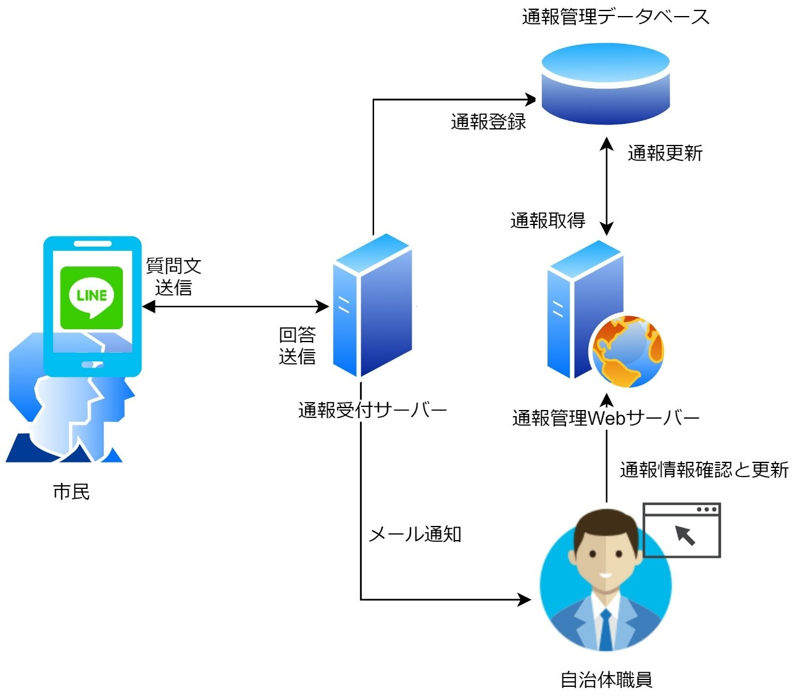

### ネットワーク構成図
&nbsp;&nbsp;システムは、AWS上に展開する。以下は危険箇所通報のネットワーク構成図だが、構成は変わらないのでそのまま流用する。 
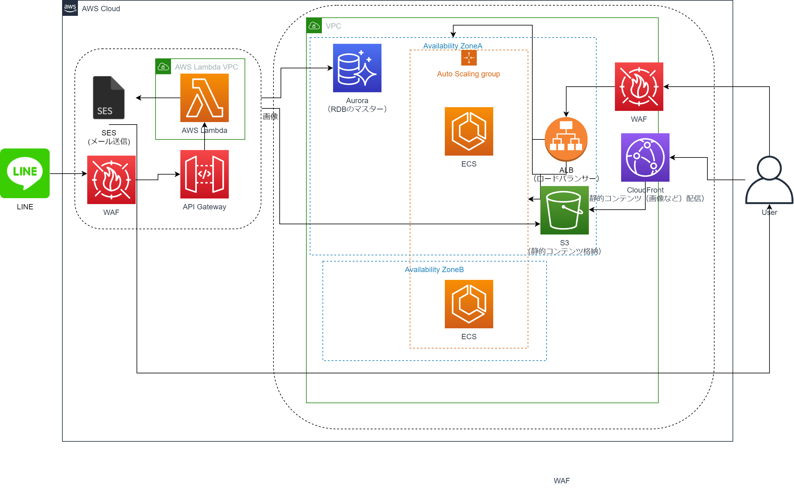

### 利用するOSミドルウェアなど一覧
以下、利用するOS・ミドルウェアなどを記載する。
| AWS サービス名  | カテゴリ               | 値                                                  |
|------------|--------------------|----------------------------------------------------|
| AWS Lambda | ランタイム              | Python3.8                                          |
| Aurora     | データベース             | Aurora PostgreSQL(Compatible with PostgreSQL 11.6) |
| EC2        | OS                 | Amazon Linux 2                                     |
| EC2        | リバースプロキシ           | Nginx 1.18.0                                       |
| EC2        | ランタイム              | Python3.8                                          |
| EC2        | wsgiサーバー           | Gunicorn 29.0.4                                    |
| EC2        | Webアプリケーションフレームワーク | Django 2.2 LTS                                     |

## 画面一覧
### Web管理ダッシュボード画面一覧
&nbsp;&nbsp;Web管理ダッシュボード画面一覧を以下に示す。ユーザー区分により表示される項目に相違がある。
| No    | 画面名                | 機能                 | 表示されるユーザー |
|-------|--------------------|--------------------|-----------|
| SC-1  | ログイン画面             | ログイン               | 全ユーザー     |
| SC-2  | パスワードリセットメール送信画面   | パスワードリセットメール送信     | 全ユーザー     |
| SC-3  | パスワードリセットメール送信完了画面 | パスワードリセットメール送信完了表示 | 全ユーザー     |
| SC-4  | Dashboard画面        | グラフなど表示            | 全ユーザー     |
| SC-5  | スポット管理画面             | スポット管理一覧表示             | 全ユーザー     |
| SC-6  | スポット登録画面             | スポット登録               | 全ユーザー     |
| SC-7  | スポット登録完了画面           | スポット登録完了表示           | 全ユーザー     |
| SC-8  | スポット詳細画面             | スポット詳細表示・更新          | 全ユーザー     |
| SC-9  | スポット更新完了画面           | スポット更新完了表示           | 全ユーザー     |
| SC-10 | スポット削除確認画面           | スポット削除               | 全ユーザー     |
| SC-11 | スポット削除完了画面           | スポット削除完了表示           | 全ユーザー     |
| SC-12 | ユーザー一覧画面           | ユーザー一覧表示           | 管理ユーザー    |
| SC-13 | ユーザー登録画面           | ユーザー登録             | 管理ユーザー    |
| SC-14 | ユーザー登録完了画面         | ユーザー登録完了表示         | 管理ユーザー    |
| SC-15 | ユーザー詳細画面           | ユーザー詳細表示・更新        | 管理ユーザー    |
| SC-16 | ユーザー更新完了画面         | ユーザー更新完了表示         | 全ユーザー     |
| SC-17 | ユーザー削除確認画面         | ユーザー削除             | 管理ユーザー    |
| SC-18 | ユーザー削除完了画面         | ユーザー削除完了表示         | 管理ユーザー    |
| SC-19 | プロフィール詳細画面（管理ユーザー) | プロフィール詳細表示・更新      | 管理ユーザー     |
| SC-20 | パスワード変更画面(管理ユーザー)  | 新パスワード設定・更新        | 管理ユーザー     |
| SC-21 | プロフィール更新完了画面       | プロフィール更新完了画面       | 全ユーザー     |
| SC-22 | プロフィール詳細画面（一般ユーザー) | プロフィール詳細表示・更新      | 一般ユーザー    |
| SC-23 | パスワード変更画面(一般ユーザー)  | 新パスワード設定・更新        | 一般ユーザー    |
| SC-24 | パスワードリセット画面        | 新パスワード設定・更新        | 全ユーザー     |
| SC-25 | パスワードリセット完了画面      | パスワードリセット完了表示      | 全ユーザー     |

## Web管理ダッシュボード画面共通設計
### フォーム入力項目チェック・エラーメッセージ設計
本システムでは入力フォームを利用する。入力に対するエラーは赤文字で各入力領域の右に表示する。「SC-1 ログイン画面」は例外としてエラーは項目ラベル右に表示する。以下チェック項目および表示メッセージ一覧を示す。
| No     | チェック名        | チェック内容                           | 表示メッセージ                 |
|--------|--------------|----------------------------------|-------------------------|
| CH-001 | 入力必須チェック     | 入力がされているか                        | xxxは入力必須です。             |
| CH-002 | Emailチェック    | 入力がメールアドレスかどうか                   | メールアドレスのフォーマットではありません。  |
| CH-003 | 存在チェック       | 指定したデータが存在しているか                  | 指定したxxxはデータベースにありません。   |
| CH-004 | 郵便番号チェック     | 郵便番号としての入力(xxx-xxxx)であるか         | 郵便番号の形式として正しくありません。     |
| CH-005 | パスワード合致チェック  | パスワードがあっているか                     | パスワードが一致していません。         |
| CH-006 | ファイル拡張子チェック  | アップロードしたファイルの拡張子があっているか          | ファイルの拡張子が正しくありません。      |
| CH-007 | パスワード文字数チェック | パスワードが8文字以上で設定されているか             | パスワードは8文字以上で設定してください。   |
| CH-008 | 2重チェック       | ２つの同じ項目の入力が一致しているか               | 確認用の入力値と一致していません。       |
| CH-009 | 重複チェック       | 重複が許されない項目について、登録済みの値を再度登録していないか | 入力された値はすでにデータベースに存在します。 |
### エラー画面設計
以下のエラーについて対応する
| No | エラーコード | 説明                    |
|----|--------|-----------------------|
| 1  | 403    | Forbidden            |
| 2  | 404    | Not Found             |
| 3  | 500    | Internal Server Error |
#### 403画面
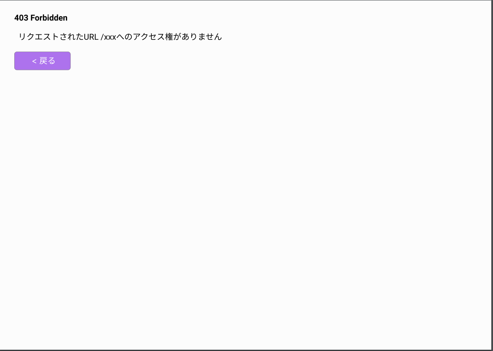 

#### 404画面
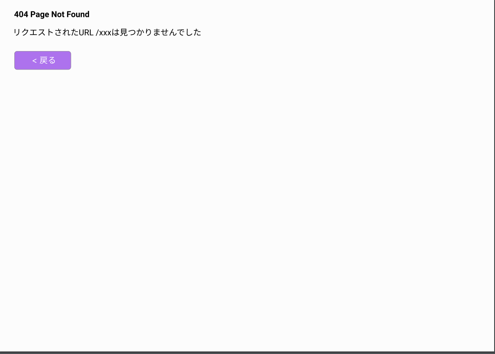 

#### 500画面
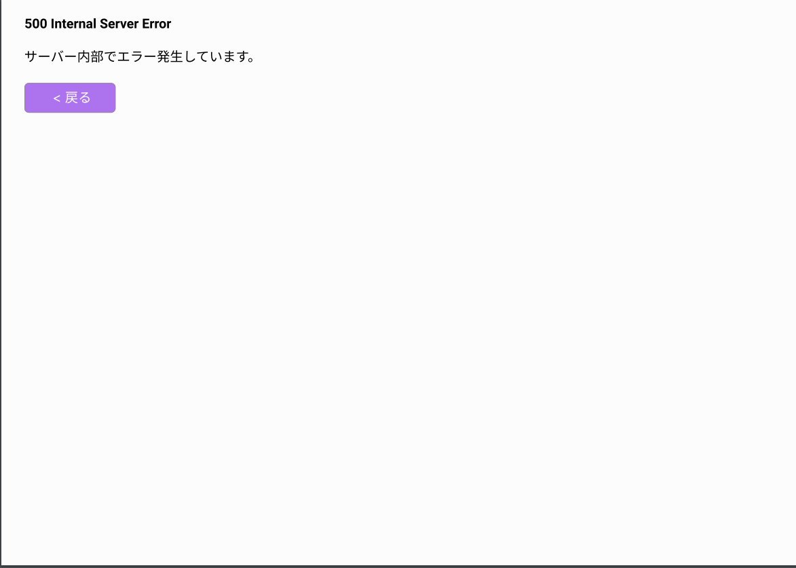 

### Web管理ダッシュボード画面機能共通設計
### レイアウト共通設計
#### ログイン後画面  
ログイン後画面に関して、レイアウト共通部分の画面機能について記載する。
画面例として、管理ユーザーログイン時におけるサマリー画面を以下に示す。  
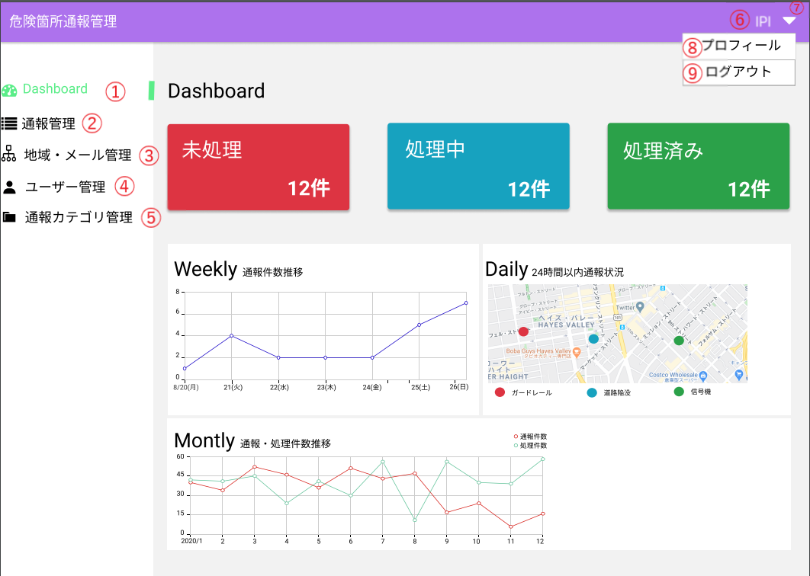 

##### 画面入出力項目一覧
| ID | 項目名称      | ラベル       | 部品種類 | 入出力区分    | 有効/無効  | データ型 | 桁 | フォーマット | 入力制約 | 繰り返し | レベル | 項目チェック | 説明                                                              | 初期表示 | 備考                                |
|----|-----------|-----------|------|----------|--------|------|---|--------|------|------|-----|--------|-----------------------------------------------------------------|------|-----------------------------------|
| ①  | dashboard | Dashboard | ボタン  | アクション    | 有効     | -    | - | -      | -    | -    | -   | -      | dashboardメニューを表示するアクション                                         | -    | -                                 |
| ②  | スポット管理      | スポット管理      | ボタン  | アクション    | 有効     | -    | - | -      | -    | -    | -   | -      | スポット管理メニューを表示するアクション                                              | -    | -                                 |
| ③  | ユーザー管理    | ユーザー管理    | ボタン  | アクション    | 条件付き有効 | -    | - | -      | -    | -    | -   | -      | ユーザー管理メニューを表示するアクション                                            | -    | 管理ユーザーログイン時表示                     |
| ④  | ログインユーザー  | なし        | ボタン  | 出力・アクション | 有効     | -    | - | -      | -    | -    | -   | -      | ログインユーザー名を表示およびアカウントメニューを表示するアクション                              | -    | -                                 |
| ⑤  | アカウントメニュー表示ボタン | なし        | ボタン  | アクション    | 有効     | -    | - | -      | -    | -    | -   | -      | アカウントメニューを表示するアクション                                             | -    | -                                 |
| ⑥  | プロフィール    | プロフィール    | ボタン  | アクション    | 有効     | -    | - | -      | -    | -    | -   | -      | 「SC-29 プロフィール詳細画面(管理ユーザー)」または「SC-31プロフィール詳細画面(一般ユーザー)を表示するアクション | -    | アカウントメニュー表示するアクション（④or⑤をクリック)後に表示 |
| ⑦  | ログアウト     | ログアウト     | ボタン  | アクション    | 有効     | -    | - | -      | -    | -    | -   | -      | ログアウト処理をするアクション                                                 | -    | アカウントメニュー表示するアクション（④or⑤をクリック)後に表示 |
##### 画面アクション明細
| ID | アクション名      | アクションの処理概要         | イベント                                                       | 入力インタフェイス | 入力 | アクションの処理詳細                            | 遷移先画面名称                                                                                                                         | 出力インタフェイス | 出力 |
|----|-------------|--------------------|------------------------------------------------------------|-----------|----|---------------------------------------|---------------------------------------------------------------------------------------------------------------------------------|-----------|----|
| 1  | 表示メニュー切り替え  | 表示しているメニューを切り替える   | メニューボタン(①～③)を押下                                            | ボタン       | -  | 選択されたメニューに表示を切り替え                     | 選択されたメニューに応じて以下画面に遷移 SC-4 サマリー画面(トップ) SC-5 スポット一覧画面 SC-11 ユーザー一覧画面 SC-17 スポットカテゴリ一覧画面 SC-23 地域・メール転送設定一覧画面  | -         | -  |
| 2  | アカウントメニュー表示 | アカウントメニューを表示       | ログインユーザー名(④)またはアカウントメニュー表示ボタン(⑤)を押下                        | ボタン       | -  | アカウントメニューを表示                          | -                                                                                                                               | -         | -  |
| 3  | プロフィール画面表示  | プロフィール詳細画面表示       | 1. ログインユーザー名(④)またはアカウントメニュー表示ボタン(⑤)を押下 2. プロフィール(⑥)を押下 | ボタン       | -  | プロフィール詳細画面に遷移                         | ログインユーザーの種類に応じて以下画面に遷移 SC-29 プロフィール詳細画面（管理ユーザー) SC-31 プロフィール詳細画面（一般ユーザー)                                                | -         | -  |
| 4  | ログアウト       | 管理ダッシュボードからログアウトする | 1. ログインユーザー名(④)またはアカウントメニュー表示ボタン(⑤)を押下 2. ログアウト(⑦)を押下  | ボタン       | -  | 1. ログアウト処理を実行 2. 「SC-1 ログイン画面」に遷移 | SC-1 ログイン画面                                                                                                                     | -         | -  |

## Web管理ダッシュボード画面機能設計

### SC-1 ログイン画面
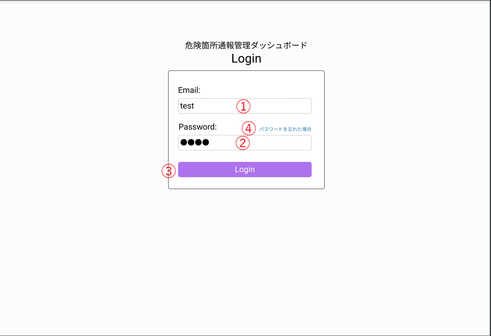 

#### 画面入出力項目一覧
| ID | 項目名称      | ラベル         | 部品種類     | 入出力区分 | 有効/無効 | データ型 | 桁   | フォーマット  | 入力制約 | 繰り返し | レベル | 項目チェック | 説明                           | 初期表示 | 備考 |
|----|-----------|-------------|----------|-------|-------|------|-----|---------|------|------|-----|--------|------------------------------|------|----|
| ①  | email     | Email       | テキストボックス | 入力    | 有効    | 文字列  | 255 | メールアドレス | -    | -    | -   | CH-003 | ユーザーのメールアドレス                 | -    | -  |
| ②  | password  | Password    | テキストボックス | 入力    | 有効    | 文字列  | 200  | パスワード   | -    | -    | -   | CH-005 | ユーザーのログインパスワード               | -    | -  |
| ③  | login     | Login       | ボタン      | アクション | 有効    | -    | -   | -       | -    | -    | -   | -      | ログイン処理をするアクション               | -    | -  |
| ④  | パスワードリセット | パスワードを忘れた場合 | ボタン      | アクション | 有効    | -    | -   | -       | -    | -    | -   | -      | 「SC-2 パスワードリセットメール送信画面」を表示するアクション | -    | -  |
#### 画面アクション明細
| ID | アクション名        | アクションの処理概要       | イベント          | 入力インタフェイス | 入力                     | アクションの処理詳細                                                                                                                                                         | 遷移先画面名称          | 出力インタフェイス   | 出力       |
|----|---------------|------------------|---------------|-----------|------------------------|--------------------------------------------------------------------------------------------------------------------------------------------------------------------|------------------|-------------|----------|
| 1  | ログイン          |  管理ダッシュボードにログインする | 「login」ボタンを押下 | フォーム      | email  password | ① emailとpasswordの入力チェック &nbsp;&nbsp;- 未入力の場合エラーを表示 ② ユーザーDBから該当ユーザーを検索する &nbsp;&nbsp;- メールアドレスが存在しない場合エラーを表示 &nbsp;&nbsp;- パスワードが存在しない場合エラーを表示 ③ ユーザーが存在する場合、「SC-4 サマリー画面（トップ）」に遷移 | SC-4 サマリー画面（トップ） | SC-1 ログイン画面 | エラーメッセージ |
| 2  | パスワードリセット画面表示 | パスワードリセット画面表示    | 「パスワードリセット」押下 | ボタン       | -                      | 「SC-2 パスワードリセット画面」に遷移                                                                                                                                              | SC-2 パスワードリセット画面 | -           | -        |

### SC-2 パスワードリセットメール送信画面
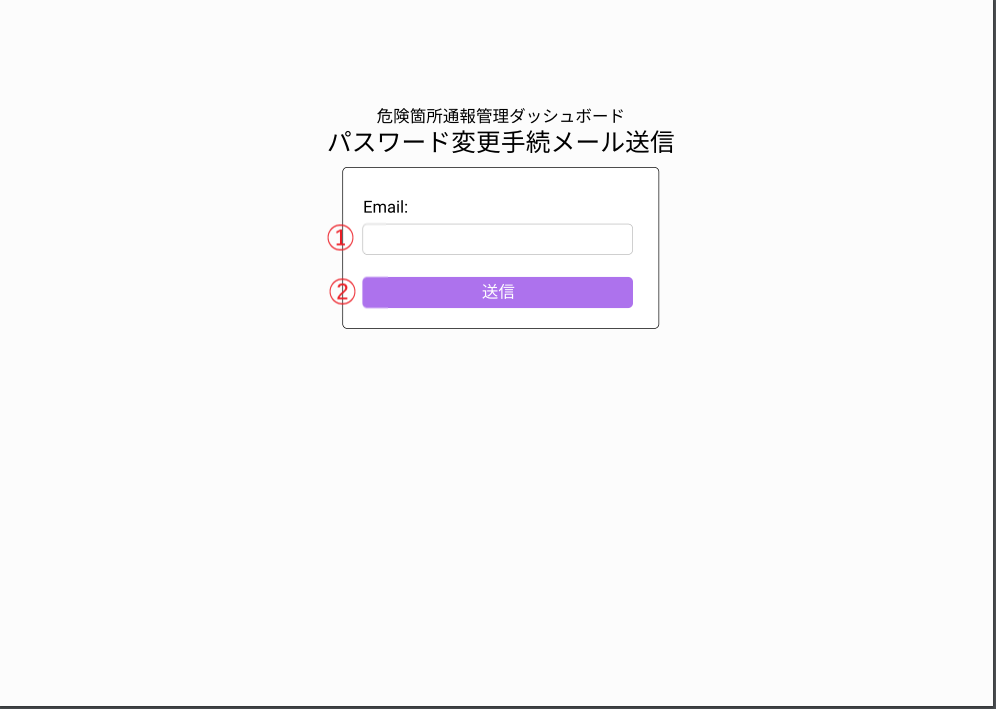 

#### 画面入出力項目一覧
| ID | 項目名称            | ラベル   | 部品種類     | 入出力区分 | 有効/無効 | データ型 | 桁   | フォーマット  | 入力制約 | 繰り返し | レベル | 項目チェック | 説明                      | 初期表示 | 備考 |
|----|-----------------|-------|----------|-------|-------|------|-----|---------|------|------|-----|--------|-------------------------|------|----|
| ①  | email           | Email | テキストボックス | 入力    | 有効    | 文字列  | 255 | メールアドレス | -    | -    | -   | CH-003 | パスワード変更メールを送信するメールアドレス  | -    | -  |
| ②  | パスワード変更手続きメール送信 | 送信    | ボタン      | アクション | 有効    | -    | -   | -       | -    | -    | -   | -      | パスワード変更手続きメールを送信するアクション | -    | -  |

#### 画面アクション明細
| ID | アクション名          | アクションの処理概要      | イベント                  | 入力インタフェイス | 入力 | アクションの処理詳細                                                                          | 遷移先画面名称                 | 出力インタフェイス | 出力 |
|----|-----------------|-----------------|-----------------------|-----------|----|-------------------------------------------------------------------------------------|-------------------------|-----------|----|
| 1  | パスワード変更手続きメール送信 | パスワード変更手続きメール送信 | パスワード変更手続きメール送信(②)を押下 | ボタン       | -  | 1. 入力メールアドレスの存在確認 - メールアドレスが存在しない場合エラー表示 2. メールアドレスが存在する場合、パスワード変更手続きをメール送信 | SC-3 パスワードリセットメール送信完了画面 | -         | -  |
### SC-3 パスワードリセットメール送信完了画面
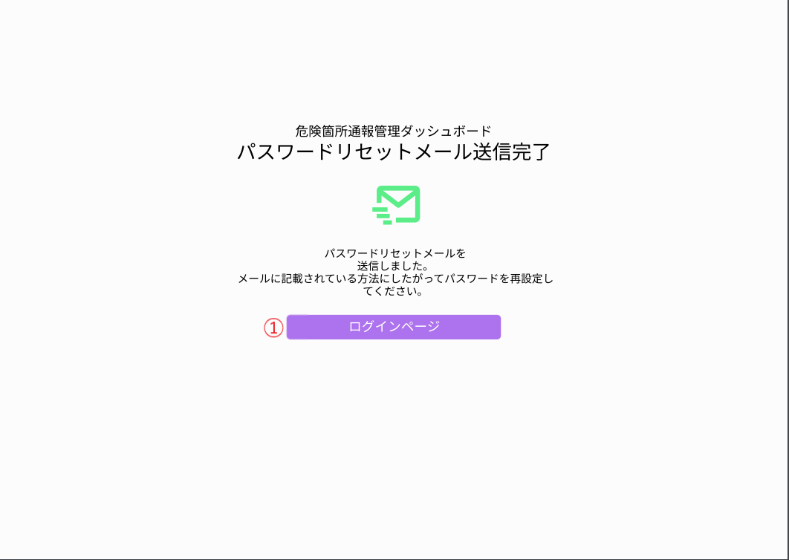 

#### 画面入出力項目一覧
| ID | 項目名称    | ラベル     | 部品種類 | 入出力区分 | 有効/無効 | データ型 | 桁 | フォーマット | 入力制約 | 繰り返し | レベル | 項目チェック | 説明                      | 初期表示 | 備考 |
|----|---------|---------|------|-------|-------|------|---|--------|------|------|-----|--------|-------------------------|------|----|
| ①  | ログインページ | ログインページ | ボタン  | アクション | 有効    | -    | - | -      | -    | -    | -   | -      | 「SC-1 ログイン画面」に遷移するアクション | -    | -  |
#### 画面アクション明細
| ID | アクション名    | アクションの処理概要 | イベント          | 入力インタフェイス | 入力 | アクションの処理詳細       | 遷移先画面名称          | 出力インタフェイス | 出力 |
|----|-----------|------------|---------------|-----------|----|------------------|------------------|-----------|----|
| 1  | ログインページ遷移 | ログインページに遷移 | ログインページ（①）を押下 | ボタン       | -  | 「SC-1 ログイン画面」に遷移 | 「SC-1 ログイン画面」に遷移 | -         | -  |
### SC-4 Dashboard画面
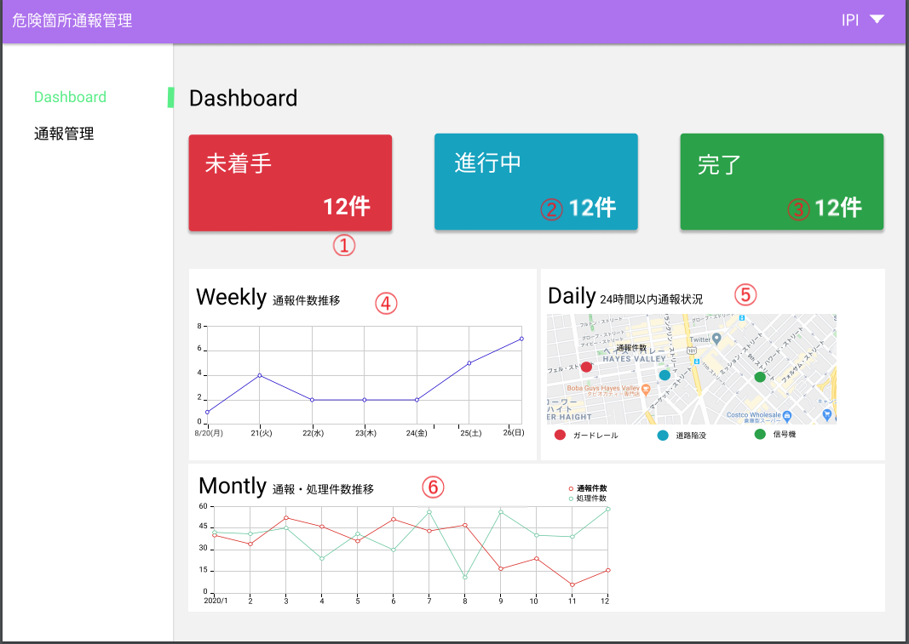 

#### 画面入出力項目一覧
「ログイン後画面」で設計した項目は割愛する。

| ID | 項目名称        | ラベル               | 部品種類           | 入出力区分 | 有効/無効 | データ型 | 桁 | フォーマット | 入力制約 | 繰り返し | レベル | 項目チェック | 説明                        | 初期表示 | 備考                   |
|----|-------------|-------------------|----------------|-------|-------|------|---|--------|------|------|-----|--------|---------------------------|------|----------------------|
| ①  | 未着手件数       | 未着手               | ラベル            | 出力    | 有効    | 数値   | - | -      | -    | -    | -   | -      | スポットのうち未着手の件数               | -    |                      |
| ②  | 進行中件数       | 進行中               | ラベル            | 出力    | 有効    | 数値   | - | -      | -    | -    | -   | -      | スポットのうち進行中の件数               | -    |                      |
| ③  | 完了件数        | 完了                | ラベル            | 出力    | 有効    | 数値   | - | -      | -    | -    | -   | -      | スポットのうち完了の件数                | -    |                      |
| ④  | 週間スポット件数推移    | Weekly スポット件数推移     | 折れ線グラフ         | 出力    | 有効    | -    | - | -      | -    | -    | -   | -      | 最近1週間のスポットを1日ごとに集計した折れ線グラフ  | -    | 当日を含む7日間             |
| ⑤  | 24時間以内スポット状況  | Daily 24時間以内スポット状況  | 地図(Google Map) | 出力    | 有効    | -    | - | -      | -    | -    | -   | -      | 24時間以内のスポット状況を示した地図         | -    | Google Maps APIを利用する |
| ⑥  | 月間スポット・処理件数推移 | Monthly スポット・処理件数推移 | 折れ線グラフ         | 出力    | 有効    | -    | - | -      | -    | -    | -   | -      | 最近1年間のスポットを1か月ごとに集計した折れ線グラフ | -    | 当月を含む12か月間           |
#### 画面アクション明細
「ログイン後画面」で設計した項目は割愛する。
| ID | アクション名   | アクションの処理概要 | イベント              | 入力インタフェイス | 入力 | アクションの処理詳細 | 遷移先画面名称 | 出力インタフェイス | 出力 |
|----|----------|------------|-------------------|-----------|----|------------|---------|-----------|----|
| 1  | 地図移動     | 地図の中心位置を変更 | 地図をドラッグ           | -         | -  | 地図の中心位置を変更 | -       | -         | -  |
| 2  | 地図zoom変更 | 地図をzoomする  | 地図をcotrol + スクロール | -         | -  | 地図をズームする   | -       | -         | -  |
### SC-5 スポット一覧画面
 

#### 入出力項目一覧
「ログイン後画面」で設計した項目は割愛する。
| ID | 項目名称        | ラベル     | 部品種類     | 入出力区分    | 有効/無効 | データ型 | 桁  | フォーマット             | 入力制約 | 繰り返し | レベル | 項目チェック | 説明                                        | 初期表示 | 備考 |
|----|-------------|---------|----------|----------|-------|------|----|--------------------|------|------|-----|--------|-------------------------------------------|------|----|
| ①  | スポット一覧        | -       | 一覧       | 出力/アクション | 有効    | -    | -  | -                  | -    | 〇    | -   | -      | スポット一覧 各スポット全体をダブルクリックするとスポット詳細画面を表示するアクション | -    | -  |
| ②  | スポット者         | スポット者     | ラベル      | 出力       | 有効    | 文字列  | 20 | -                  | -    | 〇    | -   | -      | スポット者のLine ID                               | -    | -  |
| ③  | スポットカテゴリ      | スポットカテゴリ  | ラベル      | 出力       | 有効    | 文字列  | 30 | -                  | -    | 〇    | -   | -      | スポットカテゴリ                                    | -    | -  |
| ④  | 住所          | 住所      | ラベル      | 出力       | 有効    | 文字列  | 40 | -                  | -    | 〇    | -   | -      | スポット住所                                      | -    | -  |
| ⑤  | 日時          | 日時      | ラベル      | 出力       | 有効    | 文字列  | 15 | yyyy/mm/dd hh:mm   | -    | 〇    | -   | -      | スポット日時                                      | -    | -  |
| ⑥  | 対応状況        | 対応状況    | ラベル      | 出力       | 有効    | 文字列  | 3  | 未着手/進行中/完了のいずれか    | -    | 〇    | -   | -      | スポットステータス                                   | -    | -  |
| ⑦  | スポット一覧表示件数    | -       | リストボックス  | 入力       | 有効    | -    | -  | 10,20,50,100のいずれか  | -    | -    | -   | -      | 1ページ内に表示するスポット件数                            | 10   | -  |
| ⑧  | 検索カテゴリ      | -       | リストボックス  | 入力       | 有効    | -    | -  | すべてかスポットデータのカラムのいずれか | -    | -    | -   | -      | 検索するカテゴリ                                  | すべて  | -  |
| ⑨  | 検索ワード       | -       | テキストボックス | 入力       | 有効    | 文字列  | 20 | -                  | -    | -    | -   | -      | 検索するワード(含む検索)                             | -    | -  |
| ⑩  | スポット追加        | スポットを追加する | ボタン      | アクション    | 有効    | -    | -  | -                  | -    | -    | -   | -      | スポット新規追加画面を表示するアクション                        | -    | -  |
| ⑪  | スポット一覧ページ切り替え | -       | ボタン      | アクション    | 有効    | -    | -  | -                  | -    | -    | -   | -      | 表示するスポット一覧のページを切り替える                        | -    | -  |
#### 画面アクション明細
「ログイン後画面」で設計した項目は割愛する。
| ID | アクション名        | アクションの処理概要    | イベント                | 入力インタフェイス           | 入力                   | アクションの処理詳細                                                                                                 | 遷移先画面名称     | 出力インタフェイス   | 出力            |
|----|---------------|---------------|---------------------|---------------------|----------------------|------------------------------------------------------------------------------------------------------------|-------------|-------------|---------------|
| 1  | スポット表示件数変更      | スポット表示件数変更      | 「⑦ スポット一覧表示件数」を変更     | リストボックス「⑦ スポット一覧表示件数」 | スポット一覧表示件数             | 1. 変更されたスポット一覧表示件数の値に基づき、ページ内に表示するスポット一覧を取得 2. 取得したスポット一覧を表示                                                 | -           | -           | -             |
| 2  | スポット検索          | スポットを検索         | 「⑨  検索ワード」を指定後Enter | テキストボックス 「⑨ 検索ワード」  | 検索カテゴリ 検索ワード     | 1. 検索ワードの入力チェック - 空文字列の場合は、検索せず処理終了 2. 検索カテゴリと検索ワードでスポット一覧を検索し、スポット情報を取得 3. スポット情報を指定された表示件数に基づき表示する | -           | SC-5 スポット一覧画面 | 検索されたスポット一覧     |
| 3  | スポット一覧表示ページ切り替え | スポット一覧表示ページ切り替え | 「⑪ スポット一覧ページ切り替え」を押下  | ボタン 「⑪ スポット一覧ページ切り替え」 | 押下されたページ番号または「前」「後」  | 1. 押下されたページ番号および「前」「次」ボタンより表示すべきスポットデータを取得 2. 取得したスポットデータに基づき一覧表示                                          | -           | SC-5 スポット一覧画面 | 指定されたページのスポット一覧 |
| 4  | スポット登録画面表示      | スポット登録画面表示      | 「⑩ スポットを追加する」を押下      | ボタン 「⑩スポットを追加する」      | -                    | 「SC-6　スポット登録画面」を表示                                                                                           | SC-6　スポット登録画面 | -           | -             |
| 5  | スポット詳細画面表示      | スポット詳細画面表示      | スポット一覧の行(各スポット)をダブルクリック      |  ②~⑥のスポット項目           | スポットid                 | 1.クリックされたスポットの行よりスポットidを取得 2. スポットidに基づきスポット詳細画面を表示                                                            | SC-8　スポット詳細画面 | -           | -             |
### SC-6 スポット登録画面
 

#### 画面入出力項目一覧
| ID | 項目     | 種類       | 入出力区分 | 有効 | データ型 | 入力制約                  | 繰り返し | 初期表示 | 初期表示項目 | 出力仕様 | 補足 |
|----|--------|----------|-------|----|------|-----------------------|------|------|--------|------|----|
| 1  | スポットカテゴリ | リストボックス  | 入力    | 〇  | 文字列  | RDBより取得した全スポットカテゴリ      | -    | -    | -      | -    | -  |
| 2  | スポットユーザー | テキストボックス | 入力    | 〇  | 文字列  | -                     | -    | -    | -      | -    | -  |
| 3  | 郵便番号   | テキストボックス | 入力    | 〇  | 文字列  | -                     | -    | -    | -      | -    | -  |
| 4  | 住所     | テキストボックス | 入力    | 〇  | 文字列  | -                     | -    | -    | -      | -    | -  |
| 5  | スポット日    | テキストボックス | 入力    | 〇  | 文字列  | -                     | -    | -    | -      | -    | -  |
| 6  | 全体画像   | ボタン      | 入力    | 〇  | 画像   | ファイル拡張子ははjpg,jpeg,png | -    | -    | -      | -    | -  |
| 7  | アップ画像  | ボタン      | 入力    | 〇  | 画像   | ファイル拡張子はjpg,jpeg,png  | -    | -    | -      | -    | -  |
#### 画面アクション明細
| ID | アクション名      | アクションの処理概要   | イベント                                     | 入力インタフェイス                              | 入力     | アクションの処理詳細                                                                                                 | 遷移先画面名称       | 出力インタフェイス   | 出力                        |
|----|-------------|--------------|------------------------------------------|----------------------------------------|--------|------------------------------------------------------------------------------------------------------------|---------------|-------------|---------------------------|
| 1  | スポット登録画面close | スポット登録画面を閉じる   | 「⑮ スポット新規追加画面クローズ」を押下                      | ボタン「⑮ スポット新規追加画面クローズ」                    | -      | 「SC-6 スポット登録画面」を閉じる                                                                                          | SC-5 スポット一覧画面   | -           | -                         |
| 2  | スポット登録        | スポットを新規登録する    | 「⑭ スポット新規追加」を押下                            | ボタン「⑭ スポット新規追加」                          | -      | 1. 入力されたスポット情報を検証 - 郵便番号を確認し、郵便番号の入力形式が不正の場合、エラーを表示 2. 入力されたスポット情報をデータベースに保存 3. 「SC-7 スポット登録完了画面」に遷移 | SC-7 スポット登録完了画面 | -           | -                         |
| 3  | 住所自動入力      | 郵便番号より住所自動入力 | 「④郵便番号(上3桁)」or 「⑤郵便番号(下4桁)」確定時           | テキストボックス「④郵便番号(上3桁)」or 「⑤郵便番号(下4桁)」確定時 | 郵便番号7桁 | 1. 入力されている郵便番号を検索 2. 該当する郵便番号があった場合、「⑥ 住所」に自動入力                                                        | -             | SC-6　スポット登録画面 | 住所                        |
| 4  | 全体画像アップロード  | 全体画像をアップロード  | 1.「⑨ ファイル選択」押下 2. ファイル選択ダイアログでファイル選択 | ボタン「⑨ ファイル選択」                          | 画像ファイル | 1. ファイル名を取得し、スポット新規追加画面に出力 2. サムネイル画像を、スポット新規追加画面に出力                                                       | -             | SC-6　スポット登録画面 | 全体画像ファイル名 全体サムネイル画像   |
| 5  | アップ画像アップロード | アップ画像をアップロード | 1.「⑨ ファイル選択」押下 2. ファイル選択ダイアログでファイル選択 | ボタン「⑨ ファイル選択」                          | 画像ファイル | 1. ファイル名を取得し、スポット新規追加画面に出力 2. サムネイル画像を、スポット新規追加画面に出力                                                       | -             | SC-6　スポット登録画面 | アップ画像ファイル名 アップサムネイル画像 |
### SC-7 スポット登録完了画面
「SC-5 スポット一覧画面」上部（ヘッダー下）に追加した旨のフラッシュメッセージを表示する。  
 

#### 画面入出力項目一覧
「SC-5 スポット一覧画面」の入出力項目にスポット追加フラッシュメッセージが加わる。重複するものは割愛する。
| ID | 項目名称              | ラベル       | 部品種類 | 入出力区分 | 有効/無効 | データ型 | 桁 | フォーマット | 入力制約 | 繰り返し | レベル | 項目チェック | 説明                 | 初期表示 | 備考 |
|----|-------------------|-----------|------|-------|-------|------|---|--------|------|------|-----|--------|--------------------|------|----|
| ①  | 新規追加完了フラッシューメッセージ | スポットを追加しました | ラベル  | 出力    | 有効    | -    | - | -      | -    | -    | -   | -      | スポット新規追加完了フラッシュメッセージ | -    | -  |
#### 画面アクション明細
「SC-5 スポット一覧画面」と同じであるので割愛する。
### SC-8 スポット詳細画面
 

#### 画面入出力項目一覧
| ID | 項目名称             | ラベル            | 部品種類                 | 入出力区分 | 有効/無効 | データ型 | 桁  | フォーマット           | 入力制約 | 繰り返し | レベル | 項目チェック          | 説明                     | 初期表示            | 備考                                                |  |
|----|------------------|----------------|----------------------|-------|-------|------|----|------------------|------|------|-----|-----------------|------------------------|-----------------|---------------------------------------------------|--|
| ①  | スポットカテゴリ           | スポットカテゴリ         | リストボックス              | 入力    | 有効    | -    | -  | -                | -    | -    | -   | -               | スポットカテゴリ                 | スポットデータベースから取得した値 | -                                                 |  |
| ②  | スポットユーザー           | スポットユーザー         | テキストボックス             | 入力    | 有効    | 文字列  | 20 | -                | -    | -    | -   | -               | スポットユーザー                 | スポットデータベースから取得した値 | -                                                 |  |
| ③  | 郵便番号             | 郵便番号           | テキストボックス             | 入力    | 有効    | 数値   | 7  | 郵便番号             | -    | -    | -   | CH-004 郵便番号チェック | 郵便番号                   | スポットデータベースから取得した値 | -                                                 |  |
| ④  | 郵便番号(上3桁)        | -              | テキストボックス             | 入力    | 有効    | 数値   | 3  | -                | -    | -    | -   | -               | 郵便番号の上3桁               | スポットデータベースから取得した値 | -                                                 |  |
| ⑤  | 郵便番号(下4桁)        | -              | テキストボックス             | 入力    | 有効    | 数値   | 3  | -                | -    | -    | -   | -               | 郵便番号の下4桁               | スポットデータベースから取得した値 | -                                                 |  |
| ⑥  | 住所               | 住所             | テキストボックス             | 入力    | 有効    | 文字列  | 50 | -                | -    | -    | -   | -               | 住所                     | スポットデータベースから取得した値 | -                                                 |  |
| ⑦  | スポット日              | スポット日            | テキストボックス/日付選択インタフェース | 入力    | 有効    | 文字列  | 12 | yyyy/mm/dd hh:mm | -    | -    | -   | -               | スポット日付                   | スポットデータベースから取得した値 | -                                                 |  |
| ⑧  | 全体画像アップロードファイル名  | 全体画像           | ラベル                  | 出力    | 有効    | 文字列  | 15 | -                | -    | -    | -   | -               | アップロードした全体画像ファイルの名前    | スポットデータベースから取得した値 | -                                                 |  |
| ⑨  | 全体画像ファイル選択       | ファイル選択         | ボタン                  | アクション | 有効    | -    | -  | -                | -    | -    | -   | CH-006 拡張子チェック  | 全体画像選択ダイアログを表示するアクション  | スポットデータベースから取得した値 | -                                                 |  |
| ⑩  | 全体画像             | -              | 画像                   | 出力    | 有効    | -    | -  | -                | -    | -    | -   | -               | アップロードした全体画像           | スポットデータベースから取得した値 | -                                                 |  |
| ⑪  | アップ画像アップロードファイル名 | アップ画像          | ラベル                  | 出力    | 有効    | 文字列  | 15 | -                | -    | -    | -   | -               | アップロードしたアップ画像ファイルの名前   | スポットデータベースから取得した値 | -                                                 |  |
| ⑫  | アップ画像ファイル選択      | ファイル選択         | ボタン                  | アクション | 有効    | -    | -  | -                | -    | -    | -   | CH-006 拡張子チェック  | アップ画像選択ダイアログを表示するアクション | スポットデータベースから取得した値 | -                                                 |  |
| ⑬  | アップ画像            | -              | 画像                   | 出力    | 有効    | -    | -  | -                | -    | -    | -   | -               | アップロードしたアップ画像          | スポットデータベースから取得した値 | -                                                 |  |
| ⑭  | スポット情報更新           | 更新             | ボタン                  | アクション | 有効    | -    | -  | -                | -    | -    | -   | -               | スポット更新処理をするアクション         | -               | -                                                 |  |
| ⑮  | ステータス変更１         | 進行中にするor未着手にする | ボタン                  | アクション | 有効    | -    | -  | -                | -    | -    | -   | -               | スポットステータスを更新して保存するアクション  | -               | 現在のステータスでない「未着手にする」、「進行中にする」、「完了にする」のどれか２つのボタンが生成 |  |
| ⑯  | ステータス変更2         | 進行中にするor完了にする  | ボタン                  | アクション | 有効    | -    | -  | -                | -    | -    | -   | -               | スポットステータスを更新して保存するアクション  | -               | 現在のステータスでない「未着手にする」、「進行中にする」、「完了にする」のどれか２つのボタンが生成 |  |
| ⑰  | スポット詳細画面クローズ       | ×              | ボタン                  | アクション | 有効    | -    | -  | -                | -    | -    | -   | -               | スポット新規追加画面をクローズするアクション   | -               | -                                                 |  |
| ⑱  | スポット削除確認画面オープン     | 削除             | ボタン                  | アクション | 有効    | -    | -  | -                | -    | -    | -   | -               | スポット削除確認画面をオープンするアクション   | -               | -                                                 |
#### 画面アクション明細
| ID | アクション名      | アクションの処理概要   | イベント                                     | 入力インタフェイス                              | 入力        | アクションの処理詳細                                                                                                                                      | 遷移先画面名称        | 出力インタフェイス   | 出力                        |
|----|-------------|--------------|------------------------------------------|----------------------------------------|-----------|-------------------------------------------------------------------------------------------------------------------------------------------------|----------------|-------------|---------------------------|
| 1  | スポット詳細画面close | スポット詳細画面を閉じる   | 「⑰ スポット詳細画面クローズ」を押下                        | ボタン「⑰ スポット詳細画面クローズ」                      | -         | 「SC-8　スポット詳細画面」を閉じる                                                                                                                               | SC-5 スポット一覧画面    | -           | -                         |
| 2  | スポット更新        | スポットを更新する      | 「⑭ スポット情報更新」を押下                            | ボタン「⑭ スポット情報更新」                          | -         | 1. 入力されたスポット情報を検証 - 郵便番号を確認し、郵便番号の入力形式が不正の場合、エラーを表示 2. 入力されたスポット情報をデータベースに更新保存 3. 「SC-9 スポット更新完了画面」に遷移                                    | SC-9 スポット更新完了画面  | -           | -                         |
| 3  | 住所自動入力      | 郵便番号より住所自動入力 | 「④郵便番号(上3桁)」or 「⑤郵便番号(下4桁)」確定時           | テキストボックス「④郵便番号(上3桁)」or 「⑤郵便番号(下4桁)」確定時 | 郵便番号7桁    | 1. 入力されている郵便番号を検索 2. 該当する郵便番号があった場合、「⑥ 住所」に自動入力                                                                                             | -              | SC-8 スポット詳細画面 | 住所                        |
| 4  | 全体画像アップロード  | 全体画像をアップロード  | 1.「⑨ ファイル選択」押下 2. ファイル選択ダイアログでファイル選択 | ボタン「⑨ ファイル選択」                          | 画像ファイル    | 1. ファイル名を取得し、スポット詳細画面に出力 2. サムネイル画像を、スポット詳細画面に出力                                                                                                | -              | SC-8 スポット詳細画面 | 全体画像ファイル名 全体サムネイル画像   |
| 5  | アップ画像アップロード | アップ画像をアップロード | 1.「⑨ ファイル選択」押下 2. ファイル選択ダイアログでファイル選択 | ボタン「⑨ ファイル選択」                          | 画像ファイル    | 1. ファイル名を取得し、スポット詳細画面に出力 2. サムネイル画像を、スポット詳細画面に出力                                                                                                | -              | SC-8 スポット詳細画面 | アップ画像ファイル名 アップサムネイル画像 |
| 6  | スポットステータス更新   | スポットステータスを更新   | 「⑮ ステータス変更１」or 「16 ステータス変更2」を押下          | ボタン「⑮ ステータス変更１」or 「16 ステータス変更2」        | 変更するステータス | 1. 押されたボタンより、変更するステータスを取得 2. 入力されたスポット情報を検証 - 郵便番号を確認し、郵便番号の入力形式が不正の場合、エラーを表示 3. 1,2の結果をもとにスポット情報をデータベースに更新保存 4. 「SC-9 スポット更新完了画面」に遷移 | SC-9 スポット更新完了画面  | -           | -                         |
| 7  | スポット削除確認画面表示  | スポット削除確認画面表示   | 「⑱ スポット削除確認画面オープン」を押下                      | 「⑱ スポット削除確認画面オープン」                       | -         | 「SC-10 スポット削除確認画面」を表示                                                                                                                             | SC-10 スポット削除確認画面 | -           | -                         |
### SC-9 スポット更新完了画面
 

#### 画面入出力項目一覧
「SC-5 スポット一覧画面」の入出力項目に以下のスポット更新フラッシュメッセージが加わる。重複するものは割愛する。
| ID | 項目名称              | ラベル       | 部品種類 | 入出力区分 | 有効/無効 | データ型 | 桁 | フォーマット | 入力制約 | 繰り返し | レベル | 項目チェック | 説明                 | 初期表示 | 備考 |
|----|-------------------|-----------|------|-------|-------|------|---|--------|------|------|-----|--------|--------------------|------|----|
| ①  | スポット更新完了フラッシューメッセージ | スポットを更新しました | ラベル  | 出力    | 有効    | -    | - | -      | -    | -    | -   | -      | スポット更新完了フラッシュメッセージ | -    | -  |
#### 画面アクション明細
「SC-5 スポット一覧画面」と同じであるので割愛する。

### SC-10 スポット削除確認画面
 

#### 画面入出力項目一覧
| ID | 項目名称         | ラベル   | 部品種類 | 入出力区分 | 有効/無効 | データ型 | 桁 | フォーマット | 入力制約 | 繰り返し | レベル | 項目チェック | 説明                   | 初期表示 | 備考 |
|----|--------------|-------|------|-------|-------|------|---|--------|------|------|-----|--------|----------------------|------|----|
| ①  | 削除           | 削除    | ボタン  | アクション | 有効    | -    | - | -      | -    | -    | -   | -      | スポット削除処理をするアクション       | -    | -  |
| ②  | キャンセル        | キャンセル | ボタン  | アクション | 有効    | -    | - | -      | -    | -    | -   | -      | スポット削除確認画面をクローズするアクション | -    | -  |
| ③  | スポット削除確認画面クローズ | ×     | ボタン  | アクション | 有効    | -    | - | -      | -    | -    | -   | -      | スポット削除確認画面をクローズするアクション | -    | -  |
#### 画面アクション明細
| ID | アクション名        | アクションの処理概要    | イベント                          | 入力インタフェイス                        | 入力 | アクションの処理詳細                                                             | 遷移先画面名称        | 出力インタフェイス | 出力 |
|----|---------------|---------------|-------------------------------|----------------------------------|----|------------------------------------------------------------------------|----------------|-----------|----|
| 1  | スポット削除確認画面close | スポット削除確認画面close | 「②キャンセル」or 「③スポット削除確認画面クローズ」を押下 | ボタン「②キャンセル」or ボタン「③スポット削除確認画面クローズ」 | -  | 1. 「SC-10 スポット削除確認画面」をクローズ 2. 「SC-8 スポット詳細画面」に遷移                     | SC-8 スポット詳細画面  | -         | -  |
| 2  | スポット削除          | スポット削除          | 「①削除」を押下                      | ボタン「①削除」                         | -  | 1, スポットidを取得 2. スポットidより該当のスポットデータをデータベースから削除 3. 「SC-11 スポット削除完了画面」に遷移 | SC-11 スポット削除完了画面 | -         | -  |

### SC-11 スポット削除完了画面
 

#### 画面入出力項目一覧
「SC-5 スポット一覧画面」の入出力項目に以下のスポット削除フラッシュメッセージが加わる。重複するものは割愛する。
| ID | 項目名称              | ラベル       | 部品種類 | 入出力区分 | 有効/無効 | データ型 | 桁 | フォーマット | 入力制約 | 繰り返し | レベル | 項目チェック | 説明                 | 初期表示 | 備考 |
|----|-------------------|-----------|------|-------|-------|------|---|--------|------|------|-----|--------|--------------------|------|----|
| ①  | スポット削除完了フラッシューメッセージ | スポットを削除しました | ラベル  | 出力    | 有効    | -    | - | -      | -    | -    | -   | -      | スポット削除完了フラッシュメッセージ | -    | -  |
#### 画面アクション明細
「SC-5 スポット一覧画面」と同じであるので割愛する。

### SC-12 ユーザー一覧画面
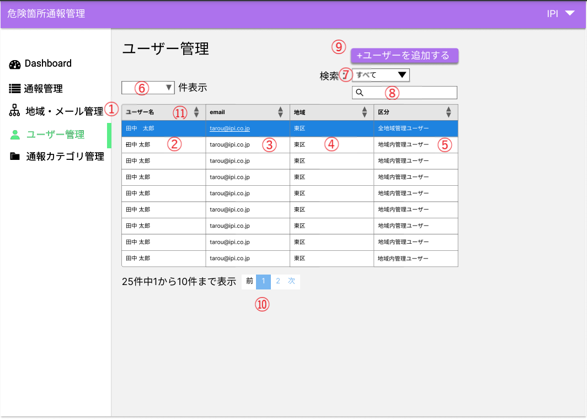 

#### 画面入出力項目一覧
| ID | 項目名称        | ラベル       | 部品種類     | 入出力区分    | 有効/無効 | データ型 | 桁   | フォーマット                          | 入力制約 | 繰り返し | レベル | 項目チェック | 説明                                           | 初期表示               | 備考 |
|----|-------------|-----------|----------|----------|-------|------|-----|---------------------------------|------|------|-----|--------|----------------------------------------------|--------------------|----|
| ①  | ユーザー一覧      | -         | 一覧       | 出力/アクション | 有効    | -    | -   | -                               | -    | 〇    | -   | -      | ユーザー一覧 各ユーザー全体をダブルクリックするとユーザー詳細画面を表示するアクション | ユーザー登録日が新しい順に上から表示 | -  |
| ②  | ユーザー名       | ユーザー名     | ラベル      | 出力       | 有効    | 文字列  | 30  | -                               | -    | 〇    | -   | -      | ユーザー名                                        | -                  | -  |
| ③  | email       | email     | ラベル      | 出力       | 有効    | 文字列  | 255 | -                               | -    | 〇    | -   | -      | ユーザーのメールアドレス                                 | -                  | -  |
| ④  | 地域          | 地域        | ラベル      | 出力       | 有効    | 文字列  | 30  | -                               | -    | 〇    | -   | -      | ユーザーが所属する地域                                  | -                  | -  |
| ⑤  | 区分          | 区分        | ラベル      | 出力       | 有効    | 文字列  | 15  | -                               | -    | 〇    | -   | -      | ユーザー区分                                       | -                  | -  |
| ⑥  | ユーザー一覧表示件数    | -         | リストボックス  | 入力       | 有効    | -    | -   | 10,20,50,100のいずれか               | -    | -    | -   | -      | 1ページ内に表示するユーザー件数                               | 10                 | -  |
| ⑦  | 検索カテゴリ      | -         | リストボックス  | 入力       | 有効    | -    | -   | すべてかユーザーデータのカラムのいずれか            | -    | -    | -   | -      | 検索するカテゴリ                                     | すべて                | -  |
| ⑧  | 検索ワード       | -         | テキストボックス | 入力       | 有効    | 文字列  | 20  | 一般ユーザー、全地域管理ユーザー、地域内管理ユーザーのいずれか | -    | -    | -   | -      | 検索するワード(含む検索)                                | -                  | -  |
| ⑨  | ユーザーを追加する   | ユーザーを追加する | ボタン      | アクション    | 有効    | -    | -   | -                               | -    | -    | -   | -      | ユーザーを新規追加画面を表示するアクション                        | -                  | -  |
| ⑩  | ユーザー一覧ページ切り替え | -         | ボタン      | アクション    | 有効    | -    | -   | -                               | -    | -    | -   | -      | ユーザー一覧のページを切り替える                             | -                  | -  |
| ⑪  | ユーザー一覧ソート   | -         | ボタン      | アクション    | 有効    | -    | -   | -                               | -    | -    | -   | -      | ユーザー情報を各カラムで昇順または降順にソートするアクション               | -                  | -  |

#### 画面アクション明細
| ID | アクション名          | アクションの処理概要      | イベント                 | 入力インタフェイス             | 入力                    | アクションの処理詳細                                                                                                       | 遷移先画面名称        | 出力インタフェイス      | 出力              |
|----|-----------------|-----------------|----------------------|-----------------------|-----------------------|------------------------------------------------------------------------------------------------------------------|----------------|----------------|-----------------|
| 1  | ユーザー表示件数変更      | ユーザー表示件数変更      | 「⑥ ユーザー一覧表示件数」を変更    | リストボックス「⑥ ユーザー一覧表示件数」 | ユーザー一覧表示件数            | 1. 変更されたユーザー一覧表示件数の値に基づき、ページ内に表示するユーザー一覧を取得 2. 取得したユーザー一覧を表示                                                 | -              | -              | -               |
| 2  | ユーザー検索          | ユーザーを検索         | 「⑧  検索ワード」を指定後Enter  | テキストボックス 「⑧ 検索ワード」    | 検索カテゴリ 検索ワード      | 1. 検索ワードの入力チェック - 空文字列の場合は、検索せず処理終了 2. 検索カテゴリと検索ワードでユーザー一覧を検索し、ユーザー情報を取得 3. ユーザー情報を指定された表示件数に基づき表示する | -              | SC-12 ユーザー一覧画面 | 検索されたユーザー一覧     |
| 3  | ユーザー一覧表示ページ切り替え | ユーザー一覧表示ページ切り替え | 「⑩ ユーザー一覧ページ切り替え」を押下 | ボタン 「⑩ ユーザー一覧ページ切り替え」 | 押下されたページ番号または「前」「後」   | 1. 押下されたページ番号および「前」「次」ボタンより表示すべきユーザーデータを取得 2. 取得したユーザーデータに基づき一覧表示                                            | -              | SC-12 ユーザー一覧画面 | 指定されたページのユーザー一覧 |
| 4  | ユーザー登録画面表示      | ユーザー登録画面表示      | 「⑨ ユーザーを追加する」を押下     | ボタン 「⑨ユーザーを追加する」      | -                     | 「SC-6　ユーザー登録画面」を表示                                                                                               | SC-13　ユーザー登録画面 | -              | -               |
| 5  | ユーザー詳細画面表示      | ユーザー詳細画面表示      | ユーザー一覧の行(各ユーザー)をダブルクリック   |  ②~⑤のユーザー項目           | ユーザーid                | 1.クリックされたユーザーの行よりユーザーidを取得 2. ユーザーidに基づきユーザー詳細画面を表示                                                          | SC-15　ユーザー詳細画面 | -              | -               |
| 6  | ユーザー一覧ソート       | ユーザー一覧ソート       | 「⑪ ユーザー一覧ソート」を押下     | ⑪ ユーザー一覧ソート           | 押下されたカラムと降順（▼)か昇順（▲)か | 1. 押下されたボタンよりどのカラムで並び替え、並び替えの方法は降順か昇順のどちらかを取得 2. イーザー一覧を1で取得した情報に基づきソートする                                    | -              | SC-12 ユーザー一覧画面 | ソートされたユーザー一覧    |

### SC-13 ユーザー登録画面
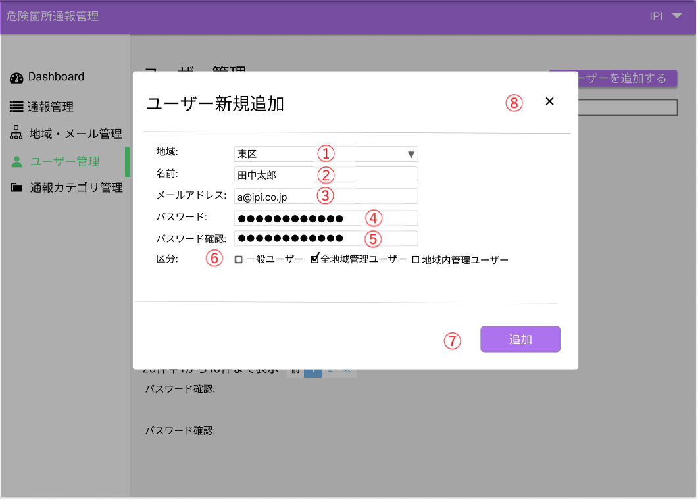 

#### 画面入出力項目一覧
| ID | 項目名称           | ラベル     | 部品種類     | 入出力区分 | 有効/無効  | データ型 | 桁   | フォーマット                          | 入力制約 | 繰り返し | レベル | 項目チェック                                | 説明                     | 初期表示 | 備考                                                                 |
|----|----------------|---------|----------|-------|--------|------|-----|---------------------------------|------|------|-----|---------------------------------------|------------------------|------|--------------------------------------------------------------------|
| ①  | 地域             | 地域      | リストボックス  | 入力    | 有効     | -    | -   | -                               | -    | -    | -   | -                                     | 地域                     | -    | -                                                                  |
| ②  | 名前             | 名前      | テキストボックス | 入力    | 有効     | 文字列  | 30  | -                               | -    | -    | -   | CH-001 入力必須チェック                       | ダッシュボードユーザー            | -    | -                                                                  |
| ③  | メールアドレス        | メールアドレス | テキストボックス | 入力    | 有効     | 文字列  | 255 | メールアドレス                         | -    | -    | -   | CH-001 入力必須チェック CH-002 Emailチェック  | メールアドレス（ログイン時に利用)      | -    | -                                                                  |
| ④  | パスワード          | -       | テキストボックス | 入力    | 有効     | 文字列  | 200  | -                               | -    | -    | -   | CH-007 パスワード文字数チェック CH-008 2重チェック | パスワード                  | -    | -                                                                  |
| ⑤  | パスワード（確認）      | -       | テキストボックス | 入力    | 有効     | 文字列  | 200  | -                               | -    | -    | -   | -                                     | パスワード（確認用)             | -    | -                                                                  |
| ⑥  | 区分             | 区分      | ラジオボタン   | 入力    | 条件付き有効 | -    | -   | 一般ユーザー、全地域管理ユーザー、地域内管理ユーザーのいずれか | -    | -    | -   | -                                     | ユーザー区分                 | -    | 全地域管理ユーザーの場合、全区分ユーザーを作成できる 地域内管理ユーザーの場合、一般ユーザーと地域内管理ユーザーを作成できる |
| ⑦  | ユーザー新規追加       | 追加      | ボタン      | アクション | 有効     | -    | -   | -                               | -    | -    | -   | -                                     | ユーザー追加処理をするアクション       | -    | -                                                                  |
| ⑧  | ユーザー新規追加画面クローズ | ×       | ボタン      | アクション | 有効     | -    | -   | -                               | -    | -    | -   | -                                     | ユーザー新規追加画面をクローズするアクション | -    | -                                                                  |
#### 画面アクション明細
| ID | アクション名        | アクションの処理概要   | イベント                  | 入力インタフェイス             | 入力 | アクションの処理詳細                                                                                                              | 遷移先画面名称          | 出力インタフェイス | 出力 |
|----|---------------|--------------|-----------------------|-----------------------|----|-------------------------------------------------------------------------------------------------------------------------|------------------|-----------|----|
| 1  | ユーザー登録画面close | ユーザー登録画面を閉じる | 「⑧ ユーザー新規追加画面クローズ」を押下 | ボタン「⑧ ユーザー新規追加画面クローズ」 | -  | 「SC-13 ユーザー登録画面」を閉じる                                                                                                    | SC-12 ユーザー一覧画面   | -         | -  |
| 2  | ユーザー登録        | ユーザーを新規登録する  | 「⑦ ユーザー新規追加」を押下       | ボタン「⑦ ユーザー新規追加」       | -  | 1. 入力されたユーザー情報を検証 - 画面入出力項目一覧で定義した項目チェックでエラーが発生した場合、エラー表示 2. 入力されたユーザー情報をデータベースに保存 3. 「SC-14 ユーザー登録完了画面」に遷移 | SC-14 ユーザー登録完了画面 | -         | -  |

### SC-14 ユーザー登録完了画面
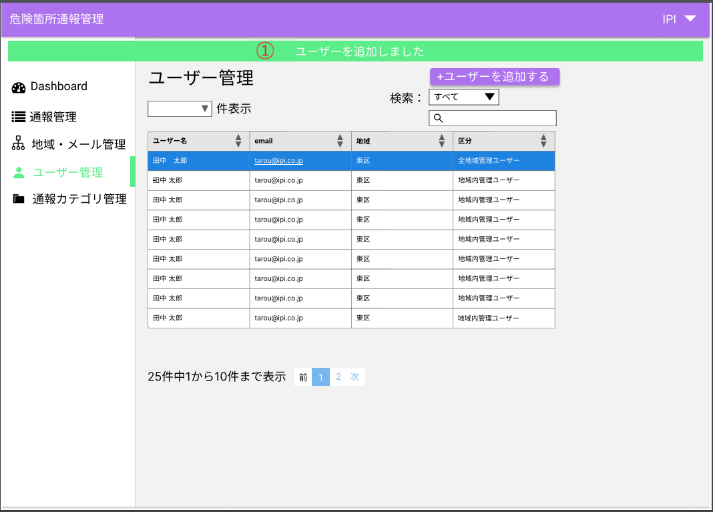 

#### 画面入出力項目一覧
「SC-12 ユーザー一覧画面」の入出力項目に以下のユーザー追加完了フラッシュメッセージが加わる。重複するものは割愛する。
| ID | 項目名称              | ラベル       | 部品種類 | 入出力区分 | 有効/無効 | データ型 | 桁 | フォーマット | 入力制約 | 繰り返し | レベル | 項目チェック | 説明                 | 初期表示 | 備考 |
|----|-------------------|-----------|------|-------|-------|------|---|--------|------|------|-----|--------|--------------------|------|----|
| ①  | ユーザー追加完了フラッシューメッセージ | ユーザーを追加しました | ラベル  | 出力    | 有効    | -    | - | -      | -    | -    | -   | -      | ユーザー追加完了フラッシュメッセージ | -    | -  |
#### 画面アクション明細
「SC-12 ユーザー一覧画面」と同じであるので割愛する。

### SC-15 ユーザー詳細画面
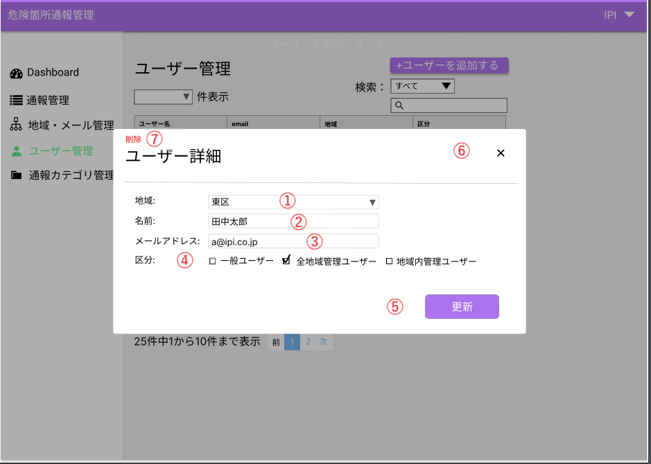 

#### 画面入出力項目一覧
| ID | 項目名称           | ラベル     | 部品種類     | 入出力区分 | 有効/無効  | データ型 | 桁   | フォーマット                          | 入力制約 | 繰り返し | レベル | 項目チェック                               | 説明                     | 初期表示              | 備考                                                                 |
|----|----------------|---------|----------|-------|--------|------|-----|---------------------------------|------|------|-----|--------------------------------------|------------------------|-------------------|--------------------------------------------------------------------|
| ①  | 地域             | 地域      | リストボックス  | 入力    | 有効     | -    | -   | -                               | -    | -    | -   | -                                    | 地域                     | ユーザーデータベースより取得した値 | -                                                                  |
| ②  | 名前             | 名前      | テキストボックス | 入力    | 有効     | 文字列  | 30  | -                               | -    | -    | -   | CH-001 入力必須チェック                      | ダッシュボードユーザー            | ユーザーデータベースより取得した値 | -                                                                  |
| ③  | メールアドレス        | メールアドレス | テキストボックス | 入力    | 有効     | 文字列  | 255 | メールアドレス                         | -    | -    | -   | CH-001 入力必須チェック CH-002 Emailチェック | メールアドレス（ログイン時に利用)      | ユーザーデータベースより取得した値 | -                                                                  |
| ④  | 区分             | 区分      | ラジオボタン   | 入力    | 条件付き有効 | -    | -   | 一般ユーザー、全地域管理ユーザー、地域内管理ユーザーのいずれか | -    | -    | -   | -                                    | ユーザー区分                 | ユーザーデータベースより取得した値 | 全地域管理ユーザーの場合、全区分ユーザーを設定できる 地域内管理ユーザーの場合、一般ユーザーと地域内管理ユーザーを設定できる |
| ⑤  | ユーザー更新         | 更新      | ボタン      | アクション | 有効     | -    | -   | -                               | -    | -    | -   | -                                    | ユーザー更新処理をするアクション       | -                 | -                                                                  |
| ⑥  | ユーザー詳細画面クローズ   | ×       | ボタン      | アクション | 有効     | -    | -   | -                               | -    | -    | -   | -                                    | ユーザー詳細画面をクローズするアクション   | -                 | -                                                                  |
| ⑦  | ユーザー削除確認画面オープン | 削除      | ボタン      | アクション | 有効     | -    | -   | -                               | -    | -    | -   | -                                    | ユーザー削除確認画面をオープンするアクション | -                 | -                                                                  | 
#### 画面アクション定義
| ID | アクション名        | アクションの処理概要   | イベント                  | 入力インタフェイス           | 入力 | アクションの処理詳細                                                                                                                | 遷移先画面名称          | 出力インタフェイス | 出力 |
|----|---------------|--------------|-----------------------|---------------------|----|---------------------------------------------------------------------------------------------------------------------------|------------------|-----------|----|
| 1  | ユーザー詳細画面close | ユーザー詳細画面を閉じる | 「⑥ ユーザー詳細画面クローズ」を押下   | ボタン「⑥ ユーザー詳細画面クローズ」 | -  | 「SC-15 ユーザー詳細画面」を閉じる                                                                                                      | SC-15 ユーザー詳細画面   | -         | -  |
| 2  | ユーザー更新        | ユーザーを更新する    | 「⑤ ユーザー更新」を押下         | ボタン「⑤ ユーザー更新」       | -  | 1. 入力されたユーザー情報を検証 - 画面入出力項目一覧で定義した項目チェックでエラーが発生した場合、エラー表示 2. 入力されたユーザー情報をデータベースに更新保存 3. 「SC-16 ユーザー更新完了画面」に遷移 | SC-16 ユーザー更新完了画面 | -         | -  |
| 3  | ユーザー削除確認画面表示  | ユーザー削除確認画面表示 | 「⑦ ユーザー削除確認画面オープン」を押下 | 「⑦ユーザー削除確認画面オープン」   | -  | 「SC-17 ユーザー削除確認画面」を表示                                                                                                     | SC-17 ユーザー削除確認画面 | -         | -  |

### SC-16 ユーザー更新完了画面
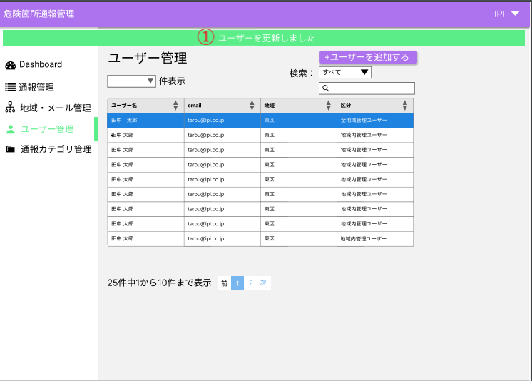 

#### 画面入出力項目一覧
「SC-12 ユーザー一覧画面」の入出力項目に以下のユーザー更新完了フラッシュメッセージが加わる。重複するものは割愛する。
| ID | 項目名称              | ラベル       | 部品種類 | 入出力区分 | 有効/無効 | データ型 | 桁 | フォーマット | 入力制約 | 繰り返し | レベル | 項目チェック | 説明                 | 初期表示 | 備考 |
|----|-------------------|-----------|------|-------|-------|------|---|--------|------|------|-----|--------|--------------------|------|----|
| ①  | ユーザー更新完了フラッシューメッセージ | ユーザーを更新しました | ラベル  | 出力    | 有効    | -    | - | -      | -    | -    | -   | -      | ユーザー更新完了フラッシュメッセージ | -    | -  |
#### 画面アクション明細
「SC-12 ユーザー一覧画面」と同じであるので割愛する。

### SC-17 ユーザー削除確認画面
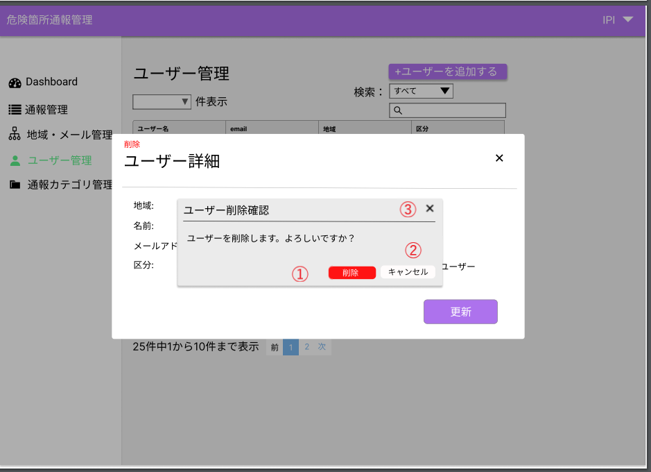 

#### 画面入出力項目一覧
| ID | 項目名称           | ラベル   | 部品種類 | 入出力区分 | 有効/無効 | データ型 | 桁 | フォーマット | 入力制約 | 繰り返し | レベル | 項目チェック | 説明                     | 初期表示 | 備考 |
|----|----------------|-------|------|-------|-------|------|---|--------|------|------|-----|--------|------------------------|------|----|
| ①  | 削除             | 削除    | ボタン  | アクション | 有効    | -    | - | -      | -    | -    | -   | -      | ユーザー削除処理をするアクション       | -    | -  |
| ②  | キャンセル          | キャンセル | ボタン  | アクション | 有効    | -    | - | -      | -    | -    | -   | -      | ユーザー削除確認画面をクローズするアクション | -    | -  |
| ③  | ユーザー削除確認画面クローズ | ×     | ボタン  | アクション | 有効    | -    | - | -      | -    | -    | -   | -      | ユーザー削除確認画面をクローズするアクション | -    | -  |

#### 画面アクション明細
| ID | アクション名          | アクションの処理概要      | イベント                            | 入力インタフェイス                          | 入力 | アクションの処理詳細                                                                     | 遷移先画面名称          | 出力インタフェイス | 出力 |
|----|-----------------|-----------------|---------------------------------|------------------------------------|----|--------------------------------------------------------------------------------|------------------|-----------|----|
| 1  | ユーザー削除確認画面close | ユーザー削除確認画面close | 「②キャンセル」or 「③ユーザー削除確認画面クローズ」を押下 | ボタン「②キャンセル」or ボタン「③ユーザー削除確認画面クローズ」 | -  | 1. 「SC-17 ユーザー削除確認画面」をクローズ 2. 「SC-15 ユーザー詳細画面」に遷移                          | SC-15 ユーザー詳細画面   | -         | -  |
| 2  | ユーザー削除          | ユーザー削除          | 「①削除」を押下                        | ボタン「①削除」                           | -  | 1, ユーザーidを取得 2. ユーザーidより該当のユーザーデータをデータベースから削除 3. 「SC-18 ユーザー削除完了画面」に遷移 | SC-18 ユーザー削除完了画面 | -         | -  |

### SC-18 ユーザー削除完了画面
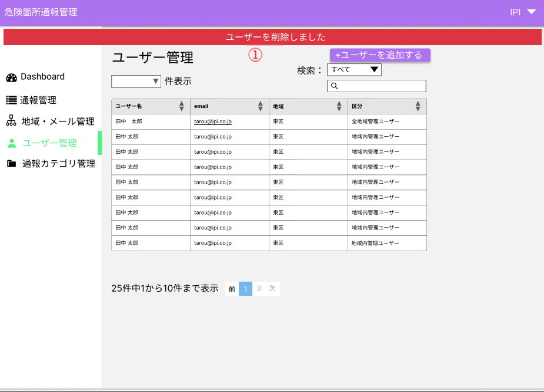 

#### 画面入出力項目一覧
「SC-12 ユーザー一覧画面」の入出力項目に以下のユーザー削除完了フラッシュメッセージが加わる。重複するものは割愛する。
| ID | 項目名称              | ラベル       | 部品種類 | 入出力区分 | 有効/無効 | データ型 | 桁 | フォーマット | 入力制約 | 繰り返し | レベル | 項目チェック | 説明                 | 初期表示 | 備考 |
|----|-------------------|-----------|------|-------|-------|------|---|--------|------|------|-----|--------|--------------------|------|----|
| ①  | ユーザー削除完了フラッシューメッセージ | ユーザーを削除しました | ラベル  | 出力    | 有効    | -    | - | -      | -    | -    | -   | -      | ユーザー削除完了フラッシュメッセージ | -    | -  |
#### 画面アクション明細
「SC-12 ユーザー一覧画面」と同じであるので割愛する。

### SC-19 プロフィール詳細画面（管理ユーザー)
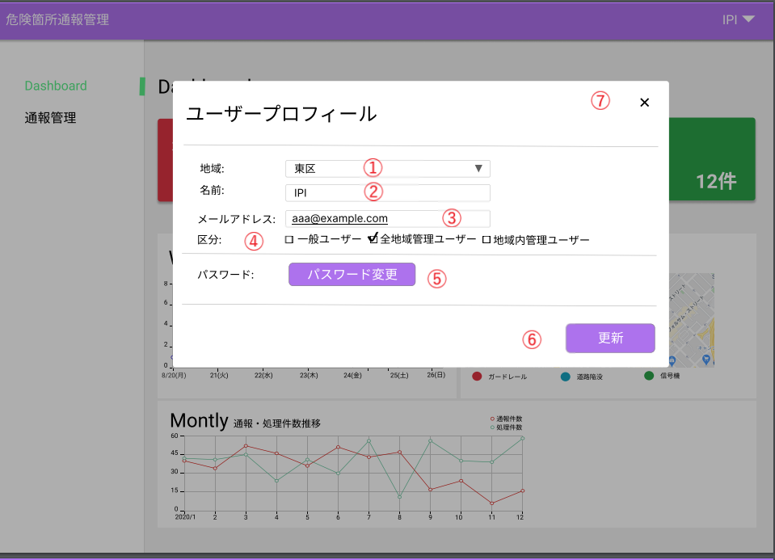 

#### 画面入出力項目一覧
| ID | 項目名称         | ラベル     | 部品種類     | 入出力区分 | 有効/無効  | データ型 | 桁   | フォーマット                          | 入力制約 | 繰り返し | レベル | 項目チェック                               | 説明                        | 初期表示              | 備考                                                                 |
|----|--------------|---------|----------|-------|--------|------|-----|---------------------------------|------|------|-----|--------------------------------------|---------------------------|-------------------|--------------------------------------------------------------------|
| ①  | 地域           | 地域      | リストボックス  | 入力    | 有効     | -    | -   | -                               | -    | -    | -   | -                                    | 地域                        | ユーザーデータベースより取得した値 | -                                                                  |
| ②  | 名前           | 名前      | テキストボックス | 入力    | 有効     | 文字列  | 30  | -                               | -    | -    | -   | CH-001 入力必須チェック                      | ダッシュボードユーザー               | ユーザーデータベースより取得した値 | -                                                                  |
| ③  | メールアドレス      | メールアドレス | テキストボックス | 入力    | 有効     | 文字列  | 255 | メールアドレス                         | -    | -    | -   | CH-001 入力必須チェック CH-002 Emailチェック | メールアドレス（ログイン時に利用)         | ユーザーデータベースより取得した値 | -                                                                  |
| ④  | 区分           | 区分      | ラジオボタン   | 入力    | 条件付き有効 | -    | -   | 一般ユーザー、全地域管理ユーザー、地域内管理ユーザーのいずれか | -    | -    | -   | -                                    | ユーザー区分                    | ユーザーデータベースより取得した値 | 全地域管理ユーザーの場合、全区分ユーザーに設定できる 地域内管理ユーザーの場合、一般ユーザーと地域内管理ユーザーに設定できる |
| ⑤  | パスワード変更      | パスワード変更 | ボタン      | アクション | 有効     | -    | -   | -                               | -    | -    | -   | -                                    | パスワード再設定入力フィールドを表示するアクション | -                 | -                                                                  |
| ⑥  | プロフィール更新     | 更新      | ボタン      | アクション | 有効     | -    | -   | -                               | -    | -    | -   | -                                    | ユーザー更新処理をするアクション          | -                 | -                                                                  |
| ⑦  | プロフィール画面クローズ | ×       | ボタン      | アクション | 有効     | -    | -   | -                               | -    | -    | -   | -                                    | プロフィール詳細画面をクローズするアクション    | -                 | -                                                                  |
#### 画面アクション明細
| ID | アクション名          | アクションの処理概要           | イベント                | 入力インタフェイス           | 入力 | アクションの処理詳細                                                                                                                  | 遷移先画面名称                  | 出力インタフェイス | 出力 |
|----|-----------------|----------------------|---------------------|---------------------|----|-----------------------------------------------------------------------------------------------------------------------------|--------------------------|-----------|----|
| 1  | プロフィール詳細画面close | プロフィール詳細画面を閉じる       | 「⑦ プロフィール画面クローズ」を押下 | ボタン「⑦ プロフィール画面クローズ」 | -  | 「SC-33 プロフィール詳細画面（管理ユーザー)」を閉じる                                                                                              | 直前に開いていた画面               | -         | -  |
| 2  | プロフィール更新        | プロフィールを更新する          | 「⑥ プロフィール更新」を押下     | ボタン「⑥ プロフィール更新」     | -  | 1. 入力されたユーザー情報を検証 - 画面入出力項目一覧で定義した項目チェックでエラーが発生した場合、エラー表示 2. 入力されたユーザー情報をデータベースに更新保存 3. 「SC-35 プロフィール更新完了画面」に遷移 | SC-35 プロフィール更新完了画面       | -         | -  |
| 3  | パスワード変更         | パスワード変更入力テキストボックスを表示 | 「⑤ パスワード変更」を押下      | ボタン「⑤ パスワード変更」      | -  | パスワード変更用入力テキストボックスを表示する(SC-34 パスワード変更画面(管理ユーザー) に遷移)                                                                        | SC-34 パスワード変更画面(管理ユーザー)  | -         | -  |

### SC-20 パスワード変更画面(管理ユーザー)
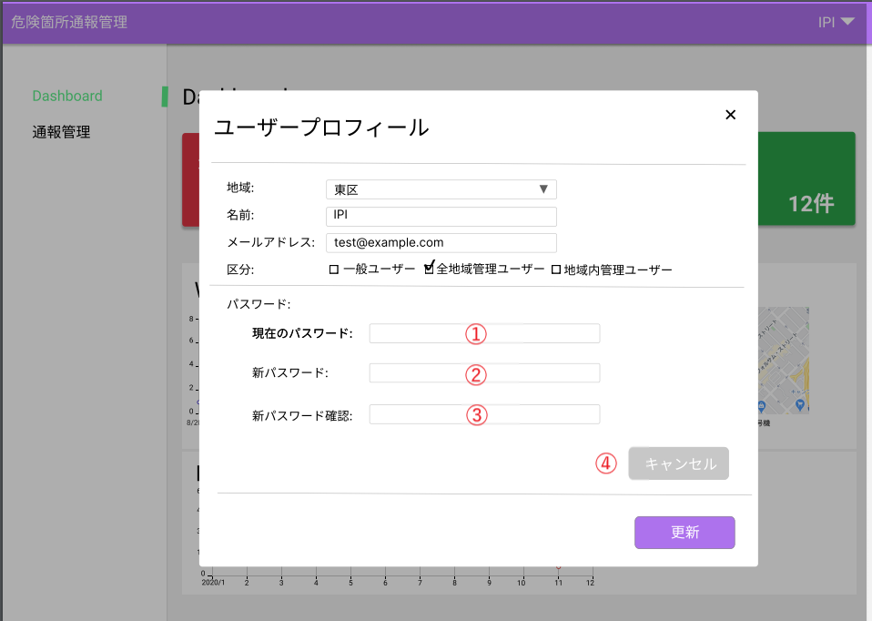 

#### 画面入出力項目一覧
| ID | 項目名称     | ラベル      | 部品種類     | 入出力区分 | 有効/無効 | データ型 | 桁   | フォーマット | 入力制約 | 繰り返し | レベル | 項目チェック                                | 説明                     | 初期表示 | 備考 |
|----|----------|----------|----------|-------|-------|------|-----|--------|------|------|-----|---------------------------------------|------------------------|------|----|
| ①  | 現在のパスワード | 現在のパスワード | テキストボックス | 入力    | 有効    | 文字列  | 200 | -      | -    | -    | -   | CH-005  パスワード合致チェック                   | 現在のパスワード               | -    | -  |
| ②  | 新パスワード   | 新パスワード   | テキストボックス | 入力    | 有効    | 文字列  | 200 | -      | -    | -    | -   | CH-007 パスワード文字数チェック CH-008 2重チェック | 新パスワード                 | -    | -  |
| ③  | 新パスワード確認 | 新パスワード確認 | テキストボックス | 入力    | 有効    | 文字列  | 200 | -      | -    | -    | -   | -                                     | 新パスワード確認               | -    | -  |
| ④  | キャンセル    | キャンセル    | ボタン      | アクション | 有効    | -    | -   | -      | -    | -    | -   | -                                     | パスワード変更入力ボックスを閉じるアクション | -    | -  |
#### 画面アクション明細
| ID | アクション名         | アクションの処理概要    | イベント         | 入力インタフェイス    | 入力 | アクションの処理詳細                    | 遷移先画面名称                  | 出力インタフェイス | 出力 |
|----|----------------|---------------|--------------|--------------|----|-------------------------------|--------------------------|-----------|----|
| 1  | パスワード変更画面close | パスワード変更画面を閉じる | 「④ キャンセル」を押下 | ボタン「④ キャンセル」 | -  | 「SC-34 パスワード変更画面(管理ユーザー)」を閉じる | SC-33 プロフィール詳細画面（管理ユーザー) | -         | -  |

### SC-21 プロフィール更新完了画面
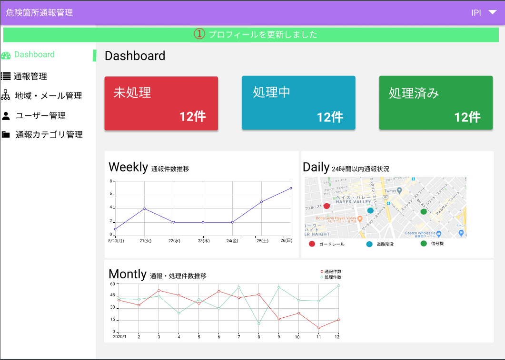 

#### 画面入出力項目一覧
各メニュー画面のの入出力項目に以下のプロフィール更新完了フラッシュメッセージが加わる。重複するものは割愛する。
| ID | 項目名称              | ラベル       | 部品種類 | 入出力区分 | 有効/無効 | データ型 | 桁 | フォーマット | 入力制約 | 繰り返し | レベル | 項目チェック | 説明                 | 初期表示 | 備考 |
|----|-------------------|-----------|------|-------|-------|------|---|--------|------|------|-----|--------|--------------------|------|----|
| ①  |プロフィール更新完了フラッシュメッセージ | プロフィールを更新しました | ラベル  | 出力    | 有効    | -    | - | -      | -    | -    | -   | -      |プロフィール更新完了フラッシュメッセージ | -    | -  |

#### 画面アクション明細
各メニューと同じなので、割愛する。

### SC-22 プロフィール詳細画面(一般ユーザー)
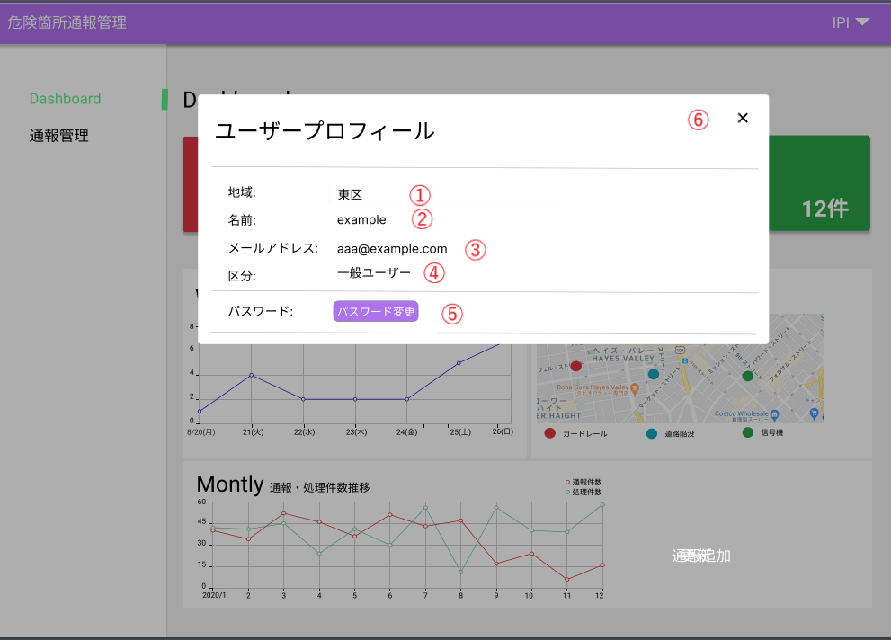 

#### 画面入出力項目一覧
| ID | 項目名称         | ラベル     | 部品種類     | 入出力区分 | 有効/無効 | データ型 | 桁   | フォーマット  | 入力制約 | 繰り返し | レベル | 項目チェック                               | 説明                        | 初期表示              | 備考 |
|----|--------------|---------|----------|-------|-------|------|-----|---------|------|------|-----|--------------------------------------|---------------------------|-------------------|----|
| ①  | 地域           | 地域      | リストボックス  | 出力    | 有効    | -    | -   | -       | -    | -    | -   | -                                    | 地域                        | ユーザーデータベースより取得した値 | -  |
| ②  | 名前           | 名前      | テキストボックス | 出力    | 有効    | 文字列  | 30  | -       | -    | -    | -   | CH-001 入力必須チェック                      | ダッシュボードユーザー               | ユーザーデータベースより取得した値 | -  |
| ③  | メールアドレス      | メールアドレス | テキストボックス | 出力    | 有効    | 文字列  | 255 | メールアドレス | -    | -    | -   | CH-001 入力必須チェック CH-002 Emailチェック | メールアドレス（ログイン時に利用)         | ユーザーデータベースより取得した値 | -  |
| ④  | 区分           | 区分      | ラジオボタン   | 入力    | 有効    | -    | -   | -       | -    | -    | -   | -                                    | ユーザー区分                    | ユーザーデータベースより取得した値 | -  |
| ⑤  | パスワード変更      | パスワード変更 | ボタン      | アクション | 有効    | -    | -   | -       | -    | -    | -   | -                                    | パスワード再設定入力フィールドを表示するアクション | -                 | -  |
| ⑥  | プロフィール画面クローズ | ×       | ボタン      | アクション | 有効    | -    | -   | -       | -    | -    | -   | -                                    | プロフィール詳細画面をクローズするアクション    | -                 | -  |

#### 画面アクション明細
| ID | アクション名          | アクションの処理概要           | イベント                | 入力インタフェイス           | 入力 | アクションの処理詳細                                           | 遷移先画面名称                  | 出力インタフェイス | 出力 |
|----|-----------------|----------------------|---------------------|---------------------|----|------------------------------------------------------|--------------------------|-----------|----|
| 1  | プロフィール詳細画面close | プロフィール詳細画面を閉じる       | 「⑥ プロフィール画面クローズ」を押下 | ボタン「⑥ プロフィール画面クローズ」 | -  | 「SC-36 プロフィール詳細画面（一般ユーザー)」を閉じる                       | 直前に開いていた画面               | -         | -  |
| 2  | パスワード変更         | パスワード変更入力テキストボックスを表示 | 「⑤ パスワード変更」を押下      | ボタン「⑤ パスワード変更」      | -  | パスワード変更用入力テキストボックスを表示する(SC-37 パスワード変更画面(一般ユーザー) に遷移) | SC-37 パスワード変更画面(一般ユーザー)  | -         | -  |

### SC-23 パスワード変更画面(一般ユーザー)
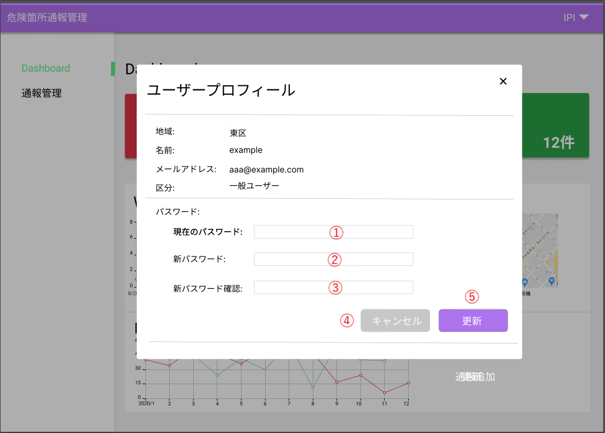 

#### 画面入出力項目一覧
| ID | 項目名称     | ラベル      | 部品種類     | 入出力区分 | 有効/無効 | データ型 | 桁   | フォーマット | 入力制約 | 繰り返し | レベル | 項目チェック                                | 説明                     | 初期表示 | 備考 |
|----|----------|----------|----------|-------|-------|------|-----|--------|------|------|-----|---------------------------------------|------------------------|------|----|
| ①  | 現在のパスワード | 現在のパスワード | テキストボックス | 入力    | 有効    | 文字列  | 200 | -      | -    | -    | -   | CH-005  パスワード合致チェック                   | 現在のパスワード               | -    | -  |
| ②  | 新パスワード   | 新パスワード   | テキストボックス | 入力    | 有効    | 文字列  | 200 | -      | -    | -    | -   | CH-007 パスワード文字数チェック CH-008 2重チェック | 新パスワード                 | -    | -  |
| ③  | 新パスワード確認 | 新パスワード確認 | テキストボックス | 入力    | 有効    | 文字列  | 200 | -      | -    | -    | -   | -                                     | 新パスワード確認               | -    | -  |
| ④  | キャンセル    | キャンセル    | ボタン      | アクション | 有効    | -    | -   | -      | -    | -    | -   | -                                     | パスワード変更入力ボックスを閉じるアクション | -    | -  |
| ⑤  | 保存       | 保存       | ボタン      | アクション | 有効    | -    | -   | -      | -    | -    | -   | -                                     | ユーザープロフィールを更新するアクション   | -    | -  |
#### 画面アクション明細
| ID | アクション名         | アクションの処理概要    | イベント            | 入力インタフェイス       | 入力 | アクションの処理詳細                                                                                                                         | 遷移先画面名称                  | 出力インタフェイス | 出力 |
|----|----------------|---------------|-----------------|-----------------|----|------------------------------------------------------------------------------------------------------------------------------------|--------------------------|-----------|----|
| 1  | パスワード変更画面close | パスワード変更画面を閉じる | 「④ キャンセル」を押下    | ボタン「④ キャンセル」    | -  | 「SC-37 パスワード変更画面(一般ユーザー)」を閉じる                                                                                                      | SC-36 プロフィール詳細画面（一般ユーザー) | -         | -  |
| 2  | プロフィール更新       | プロフィールを更新する   | 「⑤ プロフィール更新」を押下 | ボタン「⑤ プロフィール更新」 | -  | 1. 入力されたユーザー情報（パスワード)を検証 - 画面入出力項目一覧で定義した項目チェックでエラーが発生した場合、エラー表示 2. 入力されたユーザー情報をデータベースに更新保存 3. 「SC-35 プロフィール更新完了画面」に遷移 | SC-35 プロフィール更新完了画面       | -         | -  |

### SC-24 パスワードリセット画面
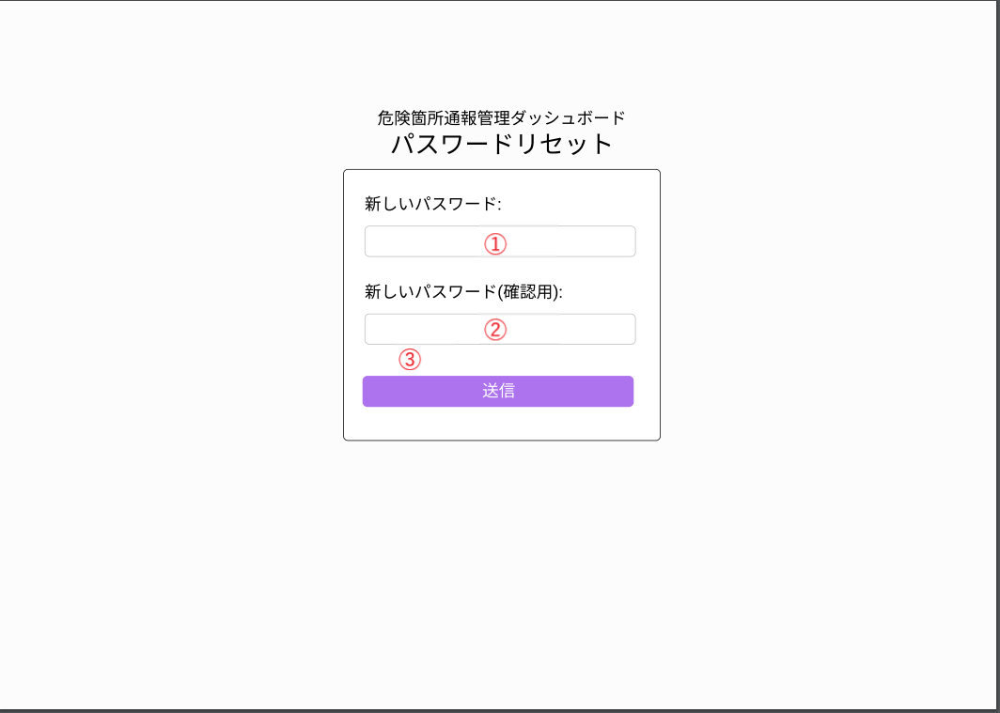 

#### 画面入出力項目一覧
| ID             | 項目名称          | ラベル           | 部品種類     | 入出力区分 | 有効/無効 | データ型 | 桁   | フォーマット | 入力制約 | 繰り返し | レベル | 項目チェック               | 説明                      | 初期表示 | 備考 |
|----------------|---------------|---------------|----------|-------|-------|------|-----|--------|------|------|-----|----------------------|-------------------------|------|----|
| ①              | 新しいパスワード      | 新しいパスワード      | テキストボックス | 入力    | 有効    | 文字列  | 200 | -      | -    | -    | -   | "CH-007 パスワード文字数チェック |
| CH-008 2重チェック" | 新しいパスワード      | -             | -        |
| ②              | 新しいパスワード(確認用) | 新しいパスワード(確認用) | テキストボックス | 入力    | 有効    | 文字列  | 200 | -      | -    | -    | -   | -                    | 新しいパスワード（確認用)           | -    | -  |
| ③              | 送信            | 送信            | ボタン      | アクション | 有効    | -    | -   | -      | -    | -    | -   | -                    | 新しいパスワードを登録する処理を行うアクション | -    | -  |
#### 画面アクション明細
| ID | アクション名    | アクションの処理概要 | イベント     | 入力インタフェイス | 入力                         | アクションの処理詳細                                                                                                                         | 遷移先画面名称             | 出力インタフェイス | 出力 |
|----|-----------|------------|----------|-----------|----------------------------|------------------------------------------------------------------------------------------------------------------------------------|---------------------|-----------|----|
| 1  | パスワードリセット | パスワードをリセット | 「③送信」を押下 | ボタン「③送信」  | 新しいパスワード 新しいパスワード（確認用) | 1. 入力されたパスワードを検証 - 画面入出力項目一覧で定義した項目チェックでエラーが発生した場合、エラー表示 2. 問題ない場合、ユーザーのパスワードを更新しデータベースに保存 3. 「SC-39 パスワードリセット完了画面」に遷移 | SC-39 パスワードリセット完了画面 | -         | -  |

### SC-25 パスワードリセット完了画面
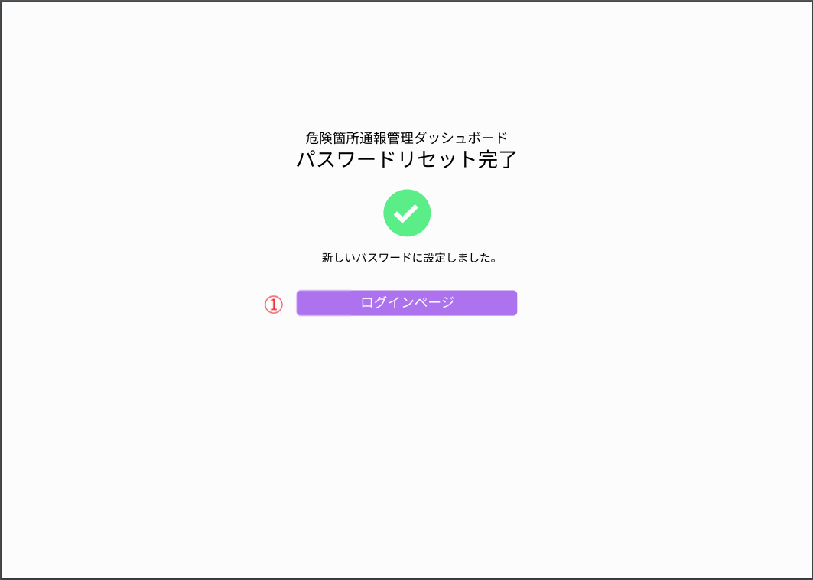 

#### 画面入出力項目一覧
| ID | 項目名称    | ラベル     | 部品種類 | 入出力区分 | 有効/無効 | データ型 | 桁 | フォーマット | 入力制約 | 繰り返し | レベル | 項目チェック | 説明           | 初期表示 | 備考 |
|----|---------|---------|------|-------|-------|------|---|--------|------|------|-----|--------|--------------|------|----|
| ①  | ログインページ | ログインページ | ボタン  | アクション | 有効/無効 | -    | - | -      | -    | -    | -   | -      | ログインページに遷移する | -    | -  |
#### 画面アクション明細

| ID | アクション名    | アクションの処理概要  | イベント          | 入力インタフェイス      | 入力 | アクションの処理詳細       | 遷移先画面名称     | 出力インタフェイス | 出力 |
|----|-----------|-------------|---------------|----------------|----|------------------|-------------|-----------|----|
| 1  | ログイン画面に遷移 | ログイン画面に遷移する | 「① ログインページ」押下 | ボタン「① ログインページ」 | -  | 「SC-1 ログイン画面」に遷移 | SC-1 ログイン画面 | -         | -  |

## テーブル・ファイル設計  
### ER図
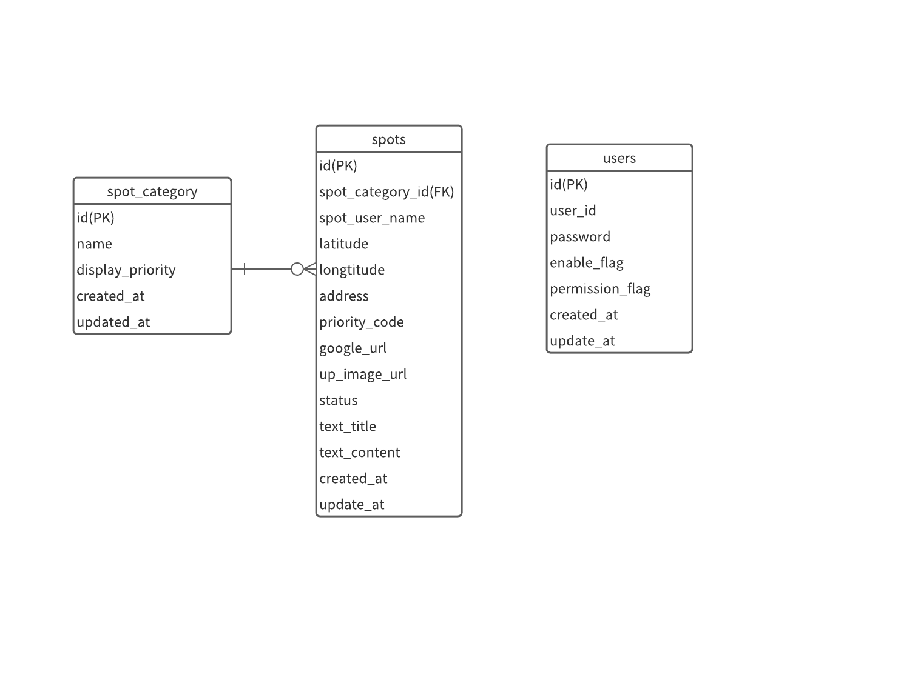 

### テーブル一覧
| No | テーブル名             | テーブル概要               |
|----|-------------------|----------------------|
| 1  | spots     | スポット管理                |
| 2  | spot_category          | 投稿カテゴリ |
| 3  | users             | webコンソールユーザー               |

### テーブル定義
#### spotsテーブル
| No | カラム名               | データ型                     | 長さ    | PK | NOT NULL  | UNIQUE | FK | オートインクリメント | デフォルト | INDEX | カラム説明               | 備考                       |
|----|--------------------|--------------------------|-------|----|-----------|--------|----|------------|-------|-------|---------------------|--------------------------|
| 1  | id                 | serial                   | 4バイト  | 〇  | 〇         | 〇      | -  | 〇          | -     | 〇     | スポットid                | フレームワーク標準                       |
| 2  | spot_category_id   | integer                  | 4バイト  | -  | 〇         | -      | 〇  | -          | -     | 〇     | スポットカテゴリid            | サービス利用                        |
| 3  | spot_user_name     | varchar                  | 30文字  | -  | -         | -      | -  | -          | -     | -     | 投稿者の名前      | -                        |
| 4  | latitude           | double precision         | 8バイト  | -  | -         | -      | -  | -          | -     | -     | おすすめスポットの緯度             | サービス利用                        |
| 5  | longtitude         | double precision         | 8バイト  | -  | -         | -      | -  | -          | -     | -     | おすすめスポットの経度             | サービス利用                        |
| 6  | address            | varchar                  | 30文字  | -  | -         | -      | -  | -          | -     | -     | 住所      | サービス利用                        |
| 7  | priority_code      | integer                  | 4バイト  | -  | 〇         | -      | -  | -          | 1     | -     | 優先度1～5             | サービス利用                        |
| 8  | google_url         | varchar                  | 200文字  | -  | -         | -      | -  | -          | -     | -     | googlemapのurl             |  サービス利用                                                |
| 9  | up_image_url       | varchar                  | 200文字 | -  | -         | -      | -  | -          | -     | -     | 画像url          | サービス利用                        |
| 10 | status             | enum                     | -     | -  | 〇         | -      | -  | -          | 未着手   | -     | スポットの進捗ステータス          |  サービス利用,enum値は"未着手"or"進行中"or"完了" |
| 11 | text_title         | varchar                  | 30文字  | -  | -         | -      | -  | -          | - | -     | スポットのタイトル  | -                        |
| 12 | text_content       | varchar                  | 200文字 | -  | -         | -      | -  | -          | -     | -     | スポットのテキスト          | サービス利用                        |
| 13 | created_at         | timestamp with time zone | 8バイト  | -  | 〇         | -      | -  | -          | -     | -     | スポット情報作成日             | フレームワーク標準                        |
| 14 | updated_at         | timestamp with time zone | 8バイト  | -  | 〇         | -      | -  | -          | -     | -     | スポット情報更新日             | フレームワーク標準                        |
#### spot_categoryテーブル
| No | カラム名            | データ型                     | 長さ    | PK | NOT NULL  | UNIQUE | FK | オートインクリメント | デフォルト | INDEX | カラム説明            | 備考                       |
|----|-----------------|--------------------------|-------|----|-----------|--------|----|------------|-------|-------|------------------|--------------------------|
| 1  | id              | serial                   | 4バイト  | 〇  | 〇         | 〇      | -  | 〇          | -     | 〇     | カテゴリid             | フレームワーク標準                        |
| 2  | name            | varchar                  | 30文字  | -  | 〇         | -      | -  | -          | -     | -     | カテゴリ名              | サービス利用                        |
| 3  | display_priority| serial                   | 4バイト  | -  | 〇         | 〇      | -  | -          | -     | -     | Lineアプリ画面表示順序  | サービス利用                        |
| 4  | created_at      | timestamp with time zone | 8バイト  | -  | 〇         | -      | -  | -          | -     | -     | 地域情報作成日          | フレームワーク標準                        |
| 5  | updated_at      | timestamp with time zone | 8バイト  | -  | 〇         | -      | -  | -          | -     | -     | 地域情報更新日          | フレームワーク標準                        |
#### usersテーブル
| No | カラム名          | データ型                     | 長さ    | PK | NOT NULL  | UNIQUE | FK | オートインクリメント | デフォルト | INDEX | カラム説明          | 備考                                       |
|----|----------------|--------------------------|-------|----|-----------|--------|----|------------|-------|-------|----------------|------------------------------------------|
| 1  | id             | serial                   | 4バイト  | 〇  | 〇         | 〇      | -  | 〇          | -     | 〇     | ユーザーid         | フレームワーク標準                                        |
| 2  | user_id        | varchar                  | 50文字  | -  | 〇         | -      | -  | -          | -     | -     | ログインid         | サービス利用                        |
| 3  | password       | text                     | -     | -  | 〇         | -      | -  | -          | -     | -     | パスワード | フレームワーク標準                                        |
| 4  | enable_flag    | boolean                  | -  | -  | 〇         | -      | -  | -          | False     | -     | 削除フラグ(Trueで論理削除) | サービス利用                        |
| 5  | permission_flag| boolean                  | - | -  | 〇         | -      | -  | -          | False     | -     | 権限フラグ(Trueで管理者権限)  | サービス利用                        |
| 6  | created_at     | timestamp with time zone | 8バイト  | -  | 〇         | -      | -  | -          | -     | -     | ユーザー情報作成日      | フレームワーク標準                                        |
| 7  | updated_at     | timestamp with time zone | 8バイト  | -  | 〇         | -      | -  | -          | -     | -     | ユーザー情報更新日      | フレームワーク標準                                        |

### ファイル一覧
| No | ファイル名     | ファイル拡張子      | ファイル概要    | ファイル命名規則                | 保存場所   | 備考 |
|----|-----------|--------------|-----------|-------------------------|--------|----|
| 1  | 危険箇所全体画像  | png,jpeg,jpg | 危険箇所全体画像  | up_image_{report_id}    | AWS S3 | -  |
| 2  | 危険箇所アップ画像 | png,jpeg,jpg | 危険箇所アップ画像 | whole_image_{report_id} | AWS S3 | -  |

## 外部インターフェイス設計
### 外部インターフェイス一覧
| No | 外部インターフェイス名 | 入出力 | システム名              | 接続方式    | 処理タイミング   |
|----|-------------|-----|--------------------|---------|-----------|
| 1  | スポット情報        | 入力  | LINE Messaging API | Web API | 24時間オンライン |
| 2  | スポットカテゴリ情報    | 出力  | LINE Messaging API | Web API | 24時間オンライン |
## 非機能要件

### 性能設計
| No | 項目                         | 関連コンポーネント                                                            | 対策                                                                                                         | 確認方法                   |
|----|----------------------------|----------------------------------------------------------------------|------------------------------------------------------------------------------------------------------------|------------------------|
| １  | LINEスポット受付システム応答のスループット・レイテンシ | - WAF - API Gateway - Lambda - SES - Aurora - S3 | - API Gatewayでスロットリングを設定し、リクエストを調整する - WAFでレートベースのルールを設定し、短時間の大量アクセスに対する防御する - Lambdaの割当てメモリを増やす   | 要件を満たすかどうか性能・負荷試験を実施する |
| 2  | Web管理ダッシュボードのスループット・レイテンシ  | - ALB - EC2 - S3 - CloudFront - RDS                  | - ALBで負荷分散をする - 適切なEC2のインスタンスタイプを利用する - cloudFrontで静的コンテンツを配信する - EC2 Auto Scalingを利用して、スケールする | 要件を満たすかどうか性能・負荷試験を実施する |
### 可用性設計
| No | 項目           | 関連コンポーネント                                                            | 対策                                                                                                                                                     |
|----|--------------|----------------------------------------------------------------------|--------------------------------------------------------------------------------------------------------------------------------------------------------|
| １  | LINEスポット受付システム | - WAF - API Gateway - Lambda - SES - Aurora - S3 | - API Gateway,Lambdaなどマネージドサービスを利用する - API Gatewayでスロットリングを設定し、リクエストを調整する - WAFでレートベースのルールを設定し、短時間の大量アクセスに対する防御する - AuroraはマルチAZ配置にする  |
| 2  | Web管理ダッシュボード | - ALB - EC2 - S3 - CloudFront - RDS                  | - ALBで負荷分散をする - EC2 Auto Scalingを利用して、スケールする                                                                                                       |
### 完全性設計
| １ | 項目            | 対策                                                                                                                                                                                              |
|---|---------------|-------------------------------------------------------------------------------------------------------------------------------------------------------------------------------------------------|
|   | データベース・ファイル   | - 完全性に配慮したサービスAWS S3を利用する - 完全性に配慮したAuroraを利用する - Auroraでバックアップを定期的にとる - Auroraでデータベースログを取得する - S3でアクセスログを取得する                                                                  |
| 2 | アプリケーション・サーバー | - api gatewayのアクセスログを取得する - AWS Lambdaのログを取得する - ALBのアクセスログを取得する - Webサーバー(nginx)のアクセスログを取得する - アプリケーション(Django)のログを取得する - 定期的に Amazon EBS スナップショットを使用して EBS ボリュームをバックアップする |

### 拡張性設計
| No | カテゴリ   | 種別            | コンポーネント名                  | 対策                                                                               |
|----|--------|---------------|---------------------------|----------------------------------------------------------------------------------|
| 1  | 規模の拡張性 | データベース・テーブル   | Aurora                    | - Auroraを利用することでストレージは自動的にスケールする - コンピューティングリソースをAWS コンソール上で変更でき、任意の時間に変更できる |
| 2  | 規模の拡張性 | アプリケーション・サーバー | EC2                       | - Auto scaling groupインスタンスの数を増やす - EC2のインスタンスタイプを変更し、CPU、サイズなどを拡張する          |
| 3  | 機能の拡張  | アプリケーション・サーバー | EC2,GitHub,GitHub Actions | - CI/CD環境を構築することで、コード修正からのデプロイまでのワークフローを自動化する                                    |
### 情報セキュリティ設計
| No | 項目        | 対策                                                                                                                  |
|----|-----------|---------------------------------------------------------------------------------------------------------------------|
| 1  | 主体認証      | - Web管理ダッシュボードはIDとパスワードによるログインシステムを実装する                                                                             |
| 2  | 権限管理      | - Web管理ダッシュボードにおいて、アカウント作成権限を管理者に限定する                                                                               |
| 3  | アクセス制御    | - Web管理ダッシュボードにおいて、一般ユーザーと管理ユーザーで利用できる機能を変更する                                                                       |
| 4  | ログの取得・管理  | - 各種サーバー、アプリにてログを取得する                                                                                               |
| 5  | データの暗号化   | - Web管理ダッシュボード、Lineスポットはhttpsを利用し経路を暗号化する - ファイル(S3)は暗号化する - Amazon Aurora DB クラスターの暗号化オプションを有効にしAuroraを暗号化する |
| 6  | 標的型攻撃対策   | - AWS ShieldによるDDos対策をとる - WAFを導入して、不正アクセス（大量アクセス）を検知しIPアドレスをブラックリスト化する                                         |
| 7  | ソフトウェア脆弱性 | - 利用ソフトウェアを整理し脆弱性情報を定期的に確認し、必要であればパッチをあてたり、アップデートする                                                                 |

### テスト方針設計
全体テスト計画.mdを参照する
### 移行方針
開発完了後、設計する
### 運用保守設計
開発完了後、設計する

